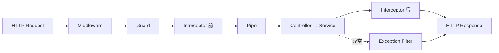

# 📘 NestJS 学习笔记（前端转 Agent 开发 · 35 天路线）

> **整理来源**：微信公众号「楠熠之」《前端转 Agent 开发》NestJS 系列连载（总览篇 + Day 1 ~ Day 4）；**Day 5 起为按 35 天路线自主扩展的内容**，与原系列无对应关系。
> **作者目标**：35 天建立完整后端开发能力，为后续 Agent 应用开发打基础。
> **本笔记状态**：🎉 **35 天路线已全部完结**（总览 + Day 1~35，九大阶段全覆盖）。
> **阅读方式**：概念优先，不背 API。每篇都强调"能回答问题才算学会"。

---

## 🗺️ 0. 整体学习路线（总览篇）

**核心定位**：NestJS 不是替代 Node.js / Express，而是在 Web Framework 之上再提供**一层应用架构**，解决"大型 Node.js 后端项目代码应该怎么组织"。

```
JavaScript / TypeScript
        ↓
      Node.js          （HTTP / Event Loop / Stream / Process）
        ↓
   Express / Fastify
        ↓
      NestJS           （Module / Controller / Provider / DI / Guard / Pipe / Interceptor / Filter / Decorator）
        ↓
   完整后端应用
```

### 35 天 · 九阶段规划

| 阶段     | 学习内容                                              | 天数     | 重要度       |
| ------ | ------------------------------------------------- | ------ | --------- |
| 一      | Module / Controller / Provider / DI / IoC         | 4      | ★★★★★     |
| 二      | 请求生命周期（Middleware/Guard/Pipe/Interceptor/Filter）  | 5      | ★★★★★     |
| 三      | REST API / DTO / Validation / Swagger             | 3      | ★★★★      |
| 四      | PostgreSQL / Prisma                               | 5      | ★★★★★     |
| 五      | JWT / Passport / RBAC                             | 4      | ★★★★★     |
| 六      | 工程化 / Testing / Docker                            | 4      | ★★★★      |
| 七      | Redis / BullMQ / SSE / WebSocket                  | 4      | ★★★★      |
| 八      | NestJS 底层原理（IoC/DI/Metadata/Dynamic Module/Scope） | 4      | ★★★★★     |
| 九      | 微服务 / MQ / CQRS                                   | 2      | ★★☆（了解即可） |
| **总计** |                                                   | **35** |           |

> **边界意识**：NestJS 不是最终目标，而是通往 Agent 的台阶。GraphQL、复杂 CQRS、Kafka 深入、gRPC 深入、大型微服务治理——第一轮先放一放，用到再回钻。
> **学习方式**：35 天不能变成 35 天看视频。全程维护一个项目，从 Hello World 逐步累加 CRUD → PostgreSQL → JWT → RBAC → Redis → BullMQ → SSE → Docker。

---

## 📗 Day 1：Module / Controller / Provider / IoC / DI

### 1.1 NestJS 在解决什么？

裸 Node.js 写大型项目很快失控；Express 给了路由但**太自由**（不约束架构）。NestJS 的价值 = **应用架构**。

### 1.2 Module：业务边界（不是"文件夹"）

```ts
@Module({ imports: [], controllers: [], providers: [], exports: [] })
export class AppModule {}
```

- `imports`：引入其他模块
- `controllers`：当前模块有哪些 Controller
- `providers`：当前模块有哪些 Provider
- Module = **模块边界 + Provider 可见性 + 依赖关系管理**

典型业务拆分：

```
AppModule
├── UserModule   (Controller + Service + Repository)
├── AuthModule   (Controller + Service + JwtStrategy)
├── AgentModule  (Controller + Service + ToolService)
└── LLMModule    (LLMService)
```

### 1.3 Controller：HTTP 层（不该堆业务）

```
HTTP Request → Controller → Service → Repository → Database
```

反例：在 Controller 里写校验/加密/写库/发事件 = "胖 Controller"。

### 1.4 Service 与 Provider

- Service 只是 Provider 最常见的一种。
- 任何能被 IoC 容器管理的对象都是 Provider（Service / Repository / Factory / Helper / Strategy …）。
- `@Injectable()` 即"把这个类注册为当前 Module 的 Provider"。

### 1.5 IoC 与 DI（本篇灵魂）

| 概念      | 全称                        | 一句话                |
| ------- | ------------------------- | ------------------ |
| **IoC** | Inversion of Control 控制反转 | **谁**负责创建对象？→ 容器   |
| **DI**  | Dependency Injection 依赖注入 | 对象**怎么**给到使用者？→ 注入 |

```ts
constructor(private readonly userService: UserService) {}
// 没有 new UserService()，由 NestJS IoC Container 注入
```

> 以前：我创建我的依赖。现在：容器创建我的依赖并交给我。

### 1.6 为什么能找到 UserService？（引出 Day 2）

TypeScript 装饰器生成 `design:paramtypes` 类型 Metadata → NestJS Scanner 读取 → 在 IoC Container 中查找并注入。

**Day 1 自检**：NestJS 为什么需要 Module？Provider 是什么？为什么 Service 不用 `new`？IoC 和 DI 是什么？

---

## 📘 Day 2：Decorator 与 Metadata

### 2.1 为什么 NestJS 到处是 `@`？

不是"好看"，是**声明式编程 + 元数据声明**。

- Express（命令式）：先执行 A → 再 B → 再 C
- NestJS（声明式）：这是 GET、路径 `:id`、要 JwtAuthGuard、参数来自 URL → Controller 接近"接口说明书"

### 2.2 Decorator 与 Metadata 的关系（核心）

| 概念            | 角色                  |
| ------------- | ------------------- |
| **Decorator** | 负责**写标签**（声明信息）     |
| **Metadata**  | 负责**保存标签**（描述数据的数据） |

类比：图片像素是数据，文件名/尺寸/修改时间是 Metadata。

### 2.3 手写最小 Metadata（脱离 NestJS 也能懂）

```ts
import 'reflect-metadata';
function Role(role: string) {
  return function (target: Function) {
    Reflect.defineMetadata('role', role, target);
  };
}
@Role('admin') class UserService {}
Reflect.getMetadata('role', UserService); // => 'admin'
```

> ⚠️ **Metadata 本身不会自动执行任何逻辑**，必须有 Guard / Reflector / Scanner 主动读取它。

### 2.4 `@Roles('admin')` + Guard 闭环

```
@Roles('admin') → SetMetadata('roles', ['admin'])
   → RolesGuard → Reflector 读取 roles
   → 判断当前用户角色 → 允许 / 拒绝
```

`@Roles()` 只声明权限信息，**真正判断权限的是 Guard**。

### 2.5 常用装饰器速查（先熟练四组）

**① 结构**
| 装饰器 | 作用 |
|---|---|
| `@Module()` | 定义业务模块 |
| `@Controller()` | 定义 HTTP Controller |
| `@Injectable()` | 声明 Provider / 参与 DI |

**② 路由**
| 装饰器 | 作用 |
|---|---|
| `@Get()` | 查询 |
| `@Post()` | 创建 |
| `@Put()` | 整体替换资源 |
| `@Patch()` | 部分修改（真实 CRUD 更常见） |
| `@Delete()` | 删除 |

**③ 参数**
| 装饰器 | 作用 |
|---|---|
| `@Body()` | Request Body |
| `@Param()` | 路径参数（默认 string，需 `ParseIntPipe` 转 number） |
| `@Query()` | 查询参数（分页/搜索/排序） |
| `@Headers()` | Header |
| `@Ip()` | 客户端 IP |

**④ 请求生命周期**
| 装饰器 | 作用 |
|---|---|
| `@UseGuards()` | JWT / 权限（门卫） |
| `@UsePipes()` | 校验 / 转换 |
| `@UseInterceptors()` | 日志 / 响应处理 |
| `@UseFilters()` | 异常处理 |
| `@SetMetadata()` | 自定义 Metadata |

> 装饰器位置分 Class / Method / Parameter 三级；Class 级对整个 Controller 生效，Method 级只对单个接口生效。

### 2.6 自定义装饰器

```ts
export const CurrentUser = createParamDecorator(
  (data: unknown, ctx: ExecutionContext) =>
    ctx.switchToHttp().getRequest().user,
);
// 用法：profile(@CurrentUser() user: User) {}
```

**Day 2 自检**：Decorator 是什么？Metadata 是什么？二者关系？Metadata 会自己执行权限吗？`@Get()` 为什么能注册路由？`@Body()` 为什么知道参数来源？

---

## 📙 Day 3：请求生命周期（Request Lifecycle）

### 3.1 两套"生命周期"（同名不同义）

| 类型         | 关注            | 关键钩子                                                                                                          |
| ---------- | ------------- | ------------------------------------------------------------------------------------------------------------- |
| **应用生命周期** | 启动/初始化/销毁     | `onModuleInit → onApplicationBootstrap → onModuleDestroy → beforeApplicationShutdown → onApplicationShutdown` |
| **请求生命周期** | 一次 HTTP 请求的流转 | `Middleware → Guard → Interceptor → Pipe → Controller → Filter`                                               |

> 应用生命周期适合管理 Database/Redis/MQ/Worker 等资源（如 `RedisService` 的连接与关闭）。本篇重点在请求链路。

### 3.2 请求链路顺序（面试必背）



一句话：**Middleware 预处理，Guard 决定能不能进，Pipe 处理输入，Interceptor 包裹执行，Controller 负责 HTTP 层，Filter 处理异常。**

### 3.3 各组件职责

| 组件                   | 一句话                                  | 典型场景                                         |
| -------------------- | ------------------------------------ | -------------------------------------------- |
| **Middleware**       | 最靠前，通用预处理；**不关心**最终进哪个 Handler       | 请求日志 / traceId / Header / Cookie             |
| **Guard**            | "门卫"：你是谁？有没有权限？能拿 `ExecutionContext` | JWT / RBAC / API Key                         |
| **Interceptor**      | 用 `next.handle()` **包裹** Handler 前后  | 统一 Response / 耗时 / 缓存                        |
| **Pipe**             | 数据"对不对"：校验 + 转换                      | `ParseIntPipe`(`"100"`→`100`)、ValidationPipe |
| **Controller**       | 进 HTTP Handler，只做收参→调 Service→返回     | —                                            |
| **Exception Filter** | 统一异常格式                               | `404 → {code,message,timestamp}`             |

### 3.4 关键澄清

- **JWT 不写 Middleware 的原因**：Middleware 不知 Handler 有无 `@Roles()`；Guard 通过 `ExecutionContext` 拿 Handler Metadata，职责更清晰。
- **Guard × Metadata 闭环**（串 Day 2）：`@Roles('admin')` → `SetMetadata('roles')` → `RolesGuard` + `Reflector` 读取判断。
- **ExecutionContext** = 当前执行上下文，可取 `Request / Handler / Controller`，支持 HTTP/WebSocket/RPC。
- **Interceptor 用 RxJS**：`next.handle()` 返回 `Observable`，可用 `tap`(日志/耗时)、`map`(统一响应)、`catchError`、`timeout`。
- **Service 不是生命周期阶段**：`Controller → Service → Repository → Database` 是**业务调用链**，框架链路里没有"Service 阶段"，两套概念别混。

**Day 3 自检**：Middleware 和 Guard 区别？Guard 为什么适合权限？Pipe 为什么负责校验？Interceptor 为什么能处理 Response？Exception Filter 何时执行？ExecutionContext 是什么？

---

## 📕 Day 4：登录实战（JWT / Guard / HttpOnly Cookie）

### 4.1 职责划分（项目结构）

```
AuthController  → 接 HTTP 请求
AuthService    → 注册/登录认证业务
UserService    → 用户数据
JwtAuthGuard   → 身份验证
DTO            → 参数描述与校验
```

> Controller 只接请求、调 Service，别把查库/加密/生成 Token 堆在 Controller。

### 4.2 `providers / exports / imports` 三句话（DI 排错核心）

| 字段          | 含义                                             |
| ----------- | ---------------------------------------------- |
| `providers` | **我有什么**（UserModule 拥有 UserService，交给 Nest 管理） |
| `exports`   | **我愿意给别人什么**（把 UserService 暴露出去）               |
| `imports`   | **我要用谁的能力**（AuthModule 引入 UserModule）          |

> 遇到 `Nest can't resolve dependencies of AuthService` → 依次查：①UserService 注册到 providers？②有 exports？③AuthModule 有 imports UserModule？

### 4.3 DTO + ValidationPipe（把 Day 2 魔法落地）

```ts
export class RegisterDto {
  @IsEmail() email: string;
  @IsString() @MinLength(6) @MaxLength(20) password: string;
  @IsString() @MinLength(2) @MaxLength(20) nickname: string;
}
// main.ts
app.useGlobalPipes(new ValidationPipe({ whitelist: true, transform: true }));
```

`@IsEmail()` 装饰器记录规则 → ValidationPipe 读 Metadata 执行校验，失败直接 `BadRequestException`，Controller 收不到脏数据。

### 4.4 密码绝不存明文

```ts
const hashed = await bcrypt.hash(dto.password, 10);  // 存 hash
const ok = await bcrypt.compare(dto.password, user.password); // 登录比对
```

### 4.5 JWT 签发

```ts
return this.jwtService.signAsync({ sub: user.id, email: user.email });
```

> **`sub` = subject = 这个 Token 属于谁**（即 userId）。

### 4.6 JWT vs Cookie 不是竞争关系（最重要认知）

- JWT 解决"身份凭证是什么"，Cookie 解决"浏览器怎么保存/发送凭证" → **JWT 放进 Cookie 一起用**。

### 4.7 HttpOnly / Secure / SameSite

| 属性         | 解决什么                                                           |
| ---------- | -------------------------------------------------------------- |
| `httpOnly` | JS 读不到 Token（降 XSS 窃取风险）；浏览器仍自动携带 → 核心价值"降低被 JS 直接窃取"          |
| `secure`   | 仅 HTTPS 发送；开发 `localhost` 通常 `secure: NODE_ENV==='production'` |
| `sameSite` | 跨站时 Cookie 是否发送，防 CSRF；`Strict`(最严) / `Lax` / `None`           |

```ts
response.cookie('access_token', token, { httpOnly: true, secure: true, sameSite: 'lax' });
// 浏览器自动保存，后续请求自动带 Cookie，前端 JS 无需读取
```

> ⚠️ HttpOnly 不解决所有 XSS；安全不是一个属性就能 cover 的。

---

## 📊 速查表

### A. 请求生命周期记忆口诀

**M-G-I-P-C-I-E** → Middleware · Guard · Interceptor(前) · Pipe · Controller · Interceptor(后) · Exception Filter

### B. IoC vs DI

- **IoC**：谁管理对象？（容器）
- **DI**：对象怎么给到使用者？（注入）

### C. 四组必熟练装饰器

结构 `@Module @Controller @Injectable` ｜ 路由 `@Get @Post @Patch @Delete` ｜ 参数 `@Body @Param @Query` ｜ 生命周期 `@UseGuards @UsePipes @UseInterceptors @UseFilters`

### D. providers / exports / imports

我有什么 / 我愿给别人什么 / 我要用谁的能力

---

## ✅ 核心自检问题清单（毕业标准参考）

- [ ] 为什么需要 Module？Provider 是什么？为什么 Service 不用 `new`？
- [ ] IoC 和 DI 是什么？`@Injectable()` 做了什么？
- [ ] Decorator 和 Metadata 是什么关系？Metadata 会自己执行逻辑吗？
- [ ] NestJS 请求生命周期是什么？Middleware/Guard/Pipe/Interceptor/Filter 区别？
- [ ] ExecutionContext 是什么？Metadata 和 Reflector 怎么协作？
- [ ] Singleton / Request / Transient 三种 Scope 区别？
- [ ] NestJS 与 Express / Fastify 是什么关系？

---

**Day 4 自检**：DTO 和 ValidationPipe 怎么协作？密码为什么不存明文？JWT 和 Cookie 是竞争关系吗？HttpOnly 解决什么问题？providers/exports/imports 三句话分别什么意思？

---

## 📘 Day 5：Middleware 深入

### 5.1 Middleware 定位

请求到达路由处理器**之前**运行的函数。能修改 `req/res`、提前结束请求、调用 `next()` 传递控制权。底层是 Express/Fastify 中间件，NestJS 做了封装。

### 5.2 函数式 vs 类式

| 写法 | 特点 | 适用场景 |
|---|---|---|
| **函数式** | `function(req, res, next)` | 简单日志、CORS |
| **类式** | `implements NestMiddleware`，可 `@Injectable()` 注入依赖 | 需要读配置/查库 |

### 5.3 注册方式：`configure` + `MiddlewareConsumer`

Middleware **没有** `@UseMiddleware()` 装饰器，在 Module 中通过 `NestModule` 接口注册：

```ts
export class AppModule implements NestModule {
  configure(consumer: MiddlewareConsumer) {
    consumer
      .apply(LoggerMiddleware)   // 指定 Middleware
      .exclude('health')          // 排除路由
      .forRoutes('users', 'admin'); // 生效路由
  }
}
```

### 5.4 Middleware vs Guard（核心区分）

| 维度 | Middleware | Guard |
|---|---|---|
| 执行时机 | 最先 | Middleware 之后 |
| 拿 ExecutionContext | ❌ | ✅ |
| 读路由 Metadata | ❌ | ✅（Reflector） |
| 控制方式 | `next()` 传递 | 返回 `boolean` / 抛异常 |
| 典型用途 | 日志、CORS、traceId | JWT、RBAC |

> JWT 用 Guard 不用 Middleware 的原因：Guard 能拿到 `@Roles()` 元数据。

### 5.5 常见实战场景

- **请求日志 + traceId**：生成 UUID 挂到 `req`，响应头写入 `X-Trace-Id`
- **CORS 跨域**：`consumer.apply(cors()).forRoutes('*')`
- **Body 解析**：`express.json({ limit: '10mb' })`
- **速率限制**：可用 Middleware 层中间件，但 `@nestjs/throttler` 更方便（Guard 层面）

### 5.6 注意事项

- **没有 Global Middleware**：`app.use()` 是 Express 原生用法，不走 NestJS 体系。全局生效 → `AppModule.configure()` 中 `forRoutes('*')`
- **`next()` 之后代码仍执行**：与 Express 一致，不是"调用即结束"
- **不支持 RxJS**：纯回调式，不像 Interceptor 返回 `Observable`

**Day 5 自检**：Middleware 执行时机？函数式和类式区别？怎么注册？为什么没有 `@UseMiddleware()`？Middleware 和 Guard 区别？为什么 JWT 用 Guard？

---

**Day 6 自检**：`CanActivate` 返回什么？`ExecutionContext` 能拿到哪三样东西？`Reflector` 的 `getAll` 和 `getAllAndOverride` 区别？为什么全局 Guard 要用 `APP_GUARD`？多个 Guard 的执行顺序？Guard 和 Middleware 最本质区别？

---

## 📗 Day 7：Pipe 深入

### 7.1 两大职责

**转换（Transformation）** + **校验（Validation）**。Pipe 在 Guard 之后、Controller 之前执行，校验失败抛 400，**Controller 根本不会执行**。

### 7.2 内置 Pipe 速查

| Pipe | 作用 |
|---|---|
| `ValidationPipe` | 基于 class-validator 校验 DTO |
| `ParseIntPipe` / `ParseFloatPipe` / `ParseBoolPipe` | 类型转换 |
| `ParseArrayPipe` / `ParseUUIDPipe` / `ParseEnumPipe` / `ParseDatePipe` | 结构化解析 |
| `DefaultValuePipe` | 提供默认值 |

### 7.3 ValidationPipe 核心选项

| 选项 | 作用 |
|---|---|
| `whitelist` | 剥离 DTO 中未声明的字段 |
| `forbidNonWhitelisted` | 有多余字段直接抛 400（比静默剥离更严格） |
| `transform` | plain object 转 DTO 类实例 |
| `disableErrorMessages` | 隐藏详细错误（生产环境） |

### 7.4 自定义 Pipe

实现 `PipeTransform`，第二参 `ArgumentMetadata` 含 `type`（body/query/param/custom）、`metatype`、`data`（字段名，用于错误信息）。

**Day 7 自检**：Pipe 的两大职责？`whitelist` 和 `forbidNonWhitelisted` 区别？`ArgumentMetadata` 三字段？Pipe 和 Guard 顺序？

---

## 📕 Day 8：Interceptor 深入

### 8.1 执行模型

基于 RxJS `Observable`，唯一能**同时**看到请求和响应的组件。执行顺序：Interceptor 前 → Guard → Pipe → Controller → Interceptor 后。

### 8.2 RxJS 操作符

| 操作符 | 作用 | 场景 |
|---|---|---|
| `tap` | 副作用，不改数据 | 日志、耗时 |
| `map` | 转换数据流 | 统一响应 `{code, data}` |
| `catchError` | 捕获错误 | 异常转换、降级 |
| `timeout` | 超时中断 | 防慢接口 |
| `of` | 构造 Observable | 缓存命中直接返回 |

### 8.3 四大实战

统一响应格式 / 耗时日志 / 响应缓存 / 超时控制

> ⚠️ `intercept()` 忘了 `return next.handle()` → 请求永久挂起

**Day 8 自检**：Interceptor 的"前""后"相对什么？`tap` 和 `map` 区别？缓存用哪个操作符？Interceptor 和 Filter 职责边界？

---

## 📘 Day 9：Exception Filter 深入

### 9.1 内置异常体系

| 异常 | 状态码 |
|---|---|
| `BadRequestException` | 400 |
| `UnauthorizedException` | 401 |
| `ForbiddenException` | 403 |
| `NotFoundException` | 404 |
| `ConflictException` | 409 |
| `TooManyRequestsException` | 429 |
| `InternalServerErrorException` | 500 |

### 9.2 自定义 Filter

实现 `ExceptionFilter` + `@Catch()`。`@Catch()` 不传参 = 捕获全部；可传具体异常类做精确捕获。

### 9.3 `ArgumentsHost` vs `ExecutionContext`

`ExecutionContext` **继承** `ArgumentsHost`，多了 `getHandler()` / `getClass()`。Filter 用基础版（异常处理不需要知道是哪个方法抛的）。

### 9.4 Filter vs Interceptor 的 `catchError`

| 方案 | 适用 |
|---|---|
| **Exception Filter** | 全局统一错误格式（兜底） |
| **Interceptor `catchError`** | 特定接口异常转换、降级 |

**建议**：统一响应 → Interceptor(`map`)；统一错误 → Filter；接口降级 → Interceptor(`catchError`)

**Day 9 自检**：Filter 在链路哪个位置？`@Catch()` 不传参捕获什么？全局 Filter 需注入依赖怎么写？生产环境要不要返回堆栈？

---

## 🎓 第二阶段完成：请求生命周期五件套

| Day | 组件 | 核心关键词 |
|---|---|---|
| Day 5 | Middleware | 通用预处理、不关心 Handler |
| Day 6 | Guard | `CanActivate`、`ExecutionContext`、`Reflector`、RBAC |
| Day 7 | Pipe | 转换 + 校验、`ValidationPipe`、`whitelist` |
| Day 8 | Interceptor | RxJS 包裹、统一响应、缓存、超时 |
| Day 9 | Exception Filter | 统一异常格式、`ArgumentsHost` |

**记忆口诀**：Middleware 管"进来"，Guard 管"能不能进"，Interceptor 管"进出都管"，Filter 管"出错了怎么办"。

---

## 📗 Day 10：REST API 设计规范

### 10.1 最大的思维陷阱：动作 vs 资源

前端转后端最容易把 RPC 风格带进来：

```
❌ RPC（动作导向）：POST /api/getUserById、POST /api/createOrder、POST /api/deleteArticle
✅ REST（资源导向）：GET /users/1、POST /orders、DELETE /articles/9
```

> **判断口诀**：URL 里出现动词，通常就是设计错了。少数例外（发验证码、搜索）才用动词，且应作为子资源。

### 10.2 HTTP 方法语义与幂等性

| 方法 | 语义 | 幂等 | 安全 | 成功状态码 |
|---|---|---|---|---|
| `GET` | 查询 | ✅ | ✅ | 200 |
| `POST` | 创建／执行动作 | ❌ | ❌ | **201 Created** |
| `PUT` | **整体替换** | ✅ | ❌ | 200 / 204 |
| `PATCH` | **局部更新** | ❌* | ❌ | 200 / 204 |
| `DELETE` | 删除 | ✅ | ❌ | 200 / **204** |

- **幂等**：执行一次与执行 N 次，服务端状态一致。
- **PUT vs PATCH**：PUT 未提供的字段会被清空；PATCH 只更新提供字段。**业务接口默认用 PATCH**。

### 10.3 状态码（别再一律返回 200）

| 状态码 | 含义 | 场景 |
|---|---|---|
| **400** | 请求本身有错 | ValidationPipe 校验失败 |
| **401** | **未认证**（不知道你是谁） | 没带 Token / Token 过期 |
| **403** | **已认证但无权限** | 普通用户访问管理员接口 |
| **404** | 资源不存在 | 查询 id 不存在 |
| **409** | 与当前资源状态冲突 | 邮箱已注册、乐观锁冲突 |
| **422** | 格式对但**业务语义**不通过 | 余额不足、库存不够 |

> **401 vs 403**：401 = 你没带身份证，403 = 你带了身份证但级别不够。

```ts
// ❌ 反模式：一律 200 + 自定义 code（网关/监控/缓存失效）
return { code: -1, message: '邮箱已存在' };

// ✅ 正确：用异常表达失败，让状态码说话
throw new ConflictException('邮箱已存在');   // 409

@Post() @HttpCode(201) create() { ... }      // 创建成功 201
@Delete(':id') @HttpCode(204) remove() { ... } // 删除成功 204
```

### 10.4 URL 命名规范

| 规则 | ❌ 反例 | ✅ 正例 |
|---|---|---|
| 用复数名词 | `/user` | `/users` |
| 小写 + 连字符 | `/userProfiles` | `/user-profiles` |
| 不出现动词 | `/users/create` | `POST /users` |
| 层级表达从属 | `/orders?userId=1` | `/users/1/orders` |
| **层级不超过两层** | `/a/1/b/2/c/3` | 拆分为 `/b/2?aId=1` |

### 10.5 查询参数（分页/筛选/排序）

```
GET /users?page=1&pageSize=20&role=admin&sort=-createdAt&keyword=张
```

```ts
export class QueryUserDto {
  @IsOptional()
  @Type(() => Number)      // ← query 全是 string，必须转换！
  @IsInt() @Min(1)
  page: number = 1;

  @IsOptional()
  @Type(() => Number) @IsInt() @Min(1) @Max(100)
  pageSize: number = 20;
}
```

> ⚠️ **`@Type(() => Number)` 是必须的**！HTTP query 里一切都是字符串，不加转换 `@IsInt()` 会校验失败。这是 Day 7 Pipe「转换 + 校验」双职责的典型落地。

### 10.6 API 版本控制

```ts
// main.ts
app.enableVersioning({ type: VersioningType.URI, defaultVersion: '1' });

@Controller({ path: 'users', version: '1' })  // → /v1/users
@Controller({ path: 'users', version: '2' })  // → /v2/users
```

| 方案 | 示例 | 优点 | 缺点 |
|---|---|---|---|
| **URL 路径**（最常用） | `/api/v1/users` | 直观、易调试、易灰度 | URL 变长 |
| 请求头 | `Accept: application/vnd.api.v1+json` | URL 干净 | 不直观 |
| 查询参数 | `/api/users?version=1` | 最简单 | 易漏传 |

> 中小项目**不必一开始就加版本号**，等真正出现破坏性变更时再引入。

### 10.7 六个常见反模式

| 反模式 | 问题 | 改法 |
|---|---|---|
| URL 里塞动词 | 退化成 RPC，接口数量爆炸 | 用 HTTP 方法表达动作 |
| 一律返回 200 + 自定义 code | 网关/监控/缓存失效 | 用标准状态码 |
| 用 GET 做写操作 | GET 应安全且幂等 | 改用 POST/PATCH/DELETE |
| 返回数据库实体原始对象 | 泄露密码哈希等 | 用响应 DTO（Day 11） |
| 分页不设上限 | 打爆内存 | `@Max(100)` |
| 嵌套层级过深 | URL 失控、权限复杂 | 控制在两层内 |

**Day 10 自检**：REST 核心思想？URL 该用名词还是动词？PUT 和 PATCH 区别？创建/删除成功返回什么状态码？401 和 403 区别？query 数字参数为何要 `@Type`？

---

## 📘 Day 11：DTO 进阶

### 11.1 DTO 本质与三作用

**DTO = Data Transfer Object**。三个核心作用：

1. **边界校验**：明确接口接受什么数据，脏数据进 Controller 前被拦下
2. **契约文档**：DTO 就是接口契约（配合 Swagger 自动生成文档）
3. **类型安全**：编译期 + 运行期双重保障

> ⚠️ **关键认知**：TypeScript `interface` 在**运行时会被擦除**，所以运行期校验**必须用 class**。这就是为什么 DTO 写成 class。

### 11.2 入参 DTO vs 出参 DTO（响应脱敏）

永远不要直接返回数据库实体（会泄露 `passwordHash`、`salt`）：

```ts
export class UserResponseDto {
  id: number;
  email: string;
  role: string;
  createdAt: Date;

  constructor(user: UserEntity) {
    this.id = user.id;
    this.email = user.email;
    this.role = user.role;
    this.createdAt = user.createdAt;
    // 注意：没有 passwordHash / salt
  }
}
```

### 11.3 嵌套对象与数组校验（最易踩的坑）

默认**不校验**嵌套对象，需要两个装饰器配合：

```ts
class CreateOrderDto {
  // 嵌套单个对象
  @ValidateNested()
  @Type(() => AddressDto)           // ← 必须！
  address: AddressDto;

  // 嵌套数组
  @IsArray()
  @ArrayMinSize(1)
  @ValidateNested({ each: true })   // ← each: true 校验每一项
  @Type(() => OrderItemDto)
  items: OrderItemDto[];
}
```

> **口诀**：嵌套对象 = `@ValidateNested()` + `@Type()`；嵌套数组 = `@IsArray()` + `@ValidateNested({ each: true })` + `@Type()`。
>
> 少了 `@Type()` 校验**静默失效**——这是最常见的线上 bug 来源之一。

### 11.4 class-transformer：转换与序列化

| 工具 | 作用 | 场景 |
|---|---|---|
| `@Type(() => X)` | 类型转换 | query string → number/boolean/Date |
| `@Transform(({value}) => ...)` | 自定义转换 | trim、toLowerCase、字符串转数组 |
| `@Exclude()` | 序列化时剔除字段 | 剔除 passwordHash |
| `@Expose()` | 显式暴露（含计算字段） | 组合 fullName |

> `@Exclude()` 生效前提：① `transform: true` ② 用 `plainToInstance()` 或全局 `ClassSerializerInterceptor`。

### 11.5 DTO 复用四工具（`@nestjs/mapped-types`）

| 工具 | 作用 | 典型场景 |
|---|---|---|
| `PartialType` | 全字段转可选 | `UpdateXxxDto` |
| `PickType` | 挑指定字段 | `LoginDto` |
| `OmitType` | 排除指定字段 | 去掉系统生成字段 |
| `IntersectionType` | 合并多个 DTO | 复合表单 |

```ts
export class UpdateUserDto extends PartialType(CreateUserDto) {}
export class LoginDto extends PickType(CreateUserDto, ['email', 'password'] as const) {}
```

> ⚠️ Swagger 项目应从 `@nestjs/swagger` 导入这些工具（保留文档元数据），而非 `@nestjs/mapped-types`。

### 11.6 自定义校验装饰器

```ts
export function IsMatch(property: string, validationOptions?: ValidationOptions) {
  return function (object: object, propertyName: string) {
    registerDecorator({
      name: 'isMatch',
      target: object.constructor,
      propertyName,
      constraints: [property],
      options: validationOptions,
      validator: {
        validate(value: any, args: ValidationArguments) {
          const [relatedPropertyName] = args.constraints;
          return value === (args.object as any)[relatedPropertyName];
        },
        defaultMessage(args) {
          return `${args.property} 必须与 ${args.constraints[0]} 一致`;
        },
      },
    });
  };
}
```

> 呼应 Day 2：**装饰器只写元数据，真正执行校验的是 ValidationPipe**。

**Day 11 自检**：为何 DTO 必须用 class？为何不能直接返回实体？嵌套校验需哪两个装饰器？`@Type` 与 `@Transform` 区别？四个复用工具用途？`@Exclude()` 生效前提？

---

## 📕 Day 12：Swagger 文档

### 12.1 价值

契约即文档（不会和代码脱节）、可交互调试、前端可自动生成 TS 类型、降低沟通成本。

> Swagger 由**装饰器元数据**驱动——正是 Day 2「装饰器写标签，框架读取执行」的体现。

### 12.2 配置

```ts
const config = new DocumentBuilder()
  .setTitle('API 文档')
  .setDescription('项目接口文档')
  .setVersion('1.0')
  .addTag('users', '用户管理')
  .addBearerAuth()                  // JWT Bearer 认证按钮
  .build();

const document = SwaggerModule.createDocument(app, config);
SwaggerModule.setup('api-docs', app, document);   // → /api-docs
```

### 12.3 装饰器速查

| 装饰器 | 作用 | 位置 |
|---|---|---|
| `@ApiTags()` | 接口分组 | Controller 类 |
| `@ApiOperation()` | 接口描述 | 方法 |
| `@ApiResponse()` | 响应定义（码 + 描述 + 类型） | 方法 |
| `@ApiBearerAuth()` | 标记需 Bearer 认证 | 类/方法 |
| `@ApiParam()` / `@ApiQuery()` | 路径/查询参数描述 | 方法 |
| `@ApiProperty()` | DTO 字段描述 | DTO 属性 |
| `@ApiExcludeEndpoint()` | 从文档隐藏接口 | 方法 |

### 12.4 DTO 联动

```ts
export class CreateUserDto {
  @ApiProperty({ description: '邮箱', example: 'user@example.com', format: 'email' })
  @IsEmail()
  email: string;

  @ApiPropertyOptional({ description: '昵称', example: '张三' })
  @IsOptional() @IsString()
  nickname?: string;

  @ApiProperty({ enum: Role, enumName: 'Role' })
  @IsEnum(Role)
  role: Role;
}
```

> ⚠️ **数组和嵌套对象必须用 `type` 显式声明**：`@ApiProperty({ type: [OrderItemDto] })`，否则 Swagger 无法推断结构。

### 12.5 两套装饰器职责不同

| 装饰器 | 职责 |
|---|---|
| `@ApiProperty({ minLength: 6 })` | **文档展示**（不校验） |
| `@MinLength(6)` | **真正校验**（class-validator） |

两者要同步维护，否则文档与实际行为不一致。

### 12.6 生产环境三种保护方案

1. **仅非生产启用**：`if (process.env.NODE_ENV !== 'production') { ... }`
2. **Basic Auth 密码**：`express-basic-auth` 中间件保护 `/api-docs`
3. **隐藏敏感接口**：`@ApiExcludeEndpoint()`

### 12.7 常见坑

| 问题 | 原因 | 解法 |
|---|---|---|
| 数组/嵌套字段文档为空 | 无法推断复杂类型 | `@ApiProperty({ type: [XxxDto] })` |
| `PartialType` 后丢失文档元数据 | 从 `mapped-types` 导入 | 改从 `@nestjs/swagger` 导入 |
| 枚举显示成数字 | 没用 `enumName` | 加 `enum: Role, enumName: 'Role'` |
| 文档有但校验不生效 | 只写 `@ApiProperty` | 补 `class-validator` 装饰器 |

**Day 12 自检**：Swagger 由什么驱动？数组/嵌套字段怎么写？`@ApiProperty` 与 `class-validator` 职责区别？`PartialType` 从哪个包导入？生产环境如何保护？

---

## 🎓 第三阶段完成：REST API / DTO / Swagger

| Day | 主题 | 核心产出 |
|---|---|---|
| Day 10 | REST API 设计规范 | 资源导向、HTTP 方法语义、状态码、URL 命名、版本控制、分页 |
| Day 11 | DTO 进阶 | 入参/出参分离、嵌套校验、`@Type`/`@Transform`、四个复用工具、自定义校验器 |
| Day 12 | Swagger 文档 | `DocumentBuilder`、装饰器体系、DTO 联动、生产环境保护 |

**一句话串联**：**用 DTO 定义契约（Day 11）→ 按 REST 规范暴露接口（Day 10）→ 自动生成文档（Day 12）**。

---

## 📗 Day 13：PostgreSQL 基础与表设计

### 13.1 数据库解决三问题

**持久化**（重启不丢）、**并发**（事务+锁）、**查询效率**（索引）。

### 13.2 选型

| 维度 | 关系型（PostgreSQL） | NoSQL（MongoDB/Redis） |
|---|---|---|
| 数据模型 | 表+行+列（严格 schema） | 文档/键值（灵活） |
| 关系表达 | 外键 JOIN 天然支持 | 弱 |
| 一致性 | 强（ACID） | 多数最终一致 |
| 适用 | **业务数据**（用户/订单） | 缓存/日志 |

> Agent 应用核心业务数据有明确结构 → 选 PostgreSQL。

### 13.3 核心概念

| 概念 | 作用 |
|---|---|
| 表 Table / 行 Row / 列 Column | 数据集合 / 实体实例 / 属性 |
| 主键 Primary Key | 唯一标识一行 |
| 外键 Foreign Key | 指向另一表主键，表达关系 |
| 索引 Index | 加速查询，拖慢写入 |

### 13.4 常用数据类型

`SERIAL`（自增主键）、`VARCHAR(n)`（字符串）、`TEXT`（长文本）、`NUMERIC(p,s)`（**金额，绝不用 FLOAT**）、`TIMESTAMP`、`JSONB`（可索引 JSON）、`UUID`。

### 13.5 三大范式

1NF（列不可再分）、2NF（非主键完全依赖主键）、3NF（消除传递依赖）。实践掌握前两范式 + 适当反范式。

### 13.6 Docker 启动

```bash
docker run -d --name nest-pg \
  -e POSTGRES_USER=postgres -e POSTGRES_PASSWORD=postgres \
  -e POSTGRES_DB=nestjs_learning -p 5432:5432 postgres:16
```

### 13.7 基础 SQL + JOIN

```sql
INSERT INTO users (email, nickname) VALUES ('a@b.com', '张三');
SELECT * FROM users WHERE email = 'a@b.com';
SELECT * FROM users ORDER BY created_at DESC LIMIT 20 OFFSET 0;
UPDATE users SET nickname = '李四' WHERE id = 1;
DELETE FROM users WHERE id = 1;

SELECT o.id, u.nickname FROM orders o JOIN users u ON o.user_id = u.id;
-- INNER JOIN 两边都匹配；LEFT JOIN 左表全保留
```

**Day 13 自检**：数据库解决哪三问题？为什么选 PostgreSQL？主键/外键/索引？金额用什么类型？JOIN 类型？

---

## 📘 Day 14：Prisma 入门

### 14.1 三件套

| 组件 | 作用 |
|---|---|
| Prisma Schema | 数据模型声明（`prisma/schema.prisma`） |
| Prisma Client | 类型安全客户端（`@prisma/client`） |
| Prisma Migrate | 迁移工具（`prisma/migrations/`） |

### 14.2 schema 语法

```prisma
model User {
  id        Int      @id @default(autoincrement())
  email     String   @unique
  role      String   @default("user")
  createdAt DateTime @default(now())
  orders    Order[]             // 一对多关系字段（不存库）
}
```

| 语法 | 含义 |
|---|---|
| `@id` / `@unique` / `@default(...)` | 主键 / 唯一 / 默认值 |
| `@relation(fields, references)` | 定义关系 |
| `?` / `[]` | 可空 / 列表 |

### 14.3 迁移

```bash
npx prisma migrate dev --name init   # 生成 + 应用迁移
npx prisma migrate deploy            # 生产：只应用
npx prisma studio                    # 可视化浏览数据
```

### 14.4 基本 CRUD

```ts
await prisma.user.create({ data: { email, nickname } });
await prisma.user.findUnique({ where: { id: 1 } });
await prisma.user.findMany();
await prisma.user.update({ where: { id }, data: { nickname } });
await prisma.user.delete({ where: { id } });
```

**Day 14 自检**：Prisma 三件套？`@relation` 作用？`migrate dev` vs `deploy`？`findUnique` vs `findFirst`？

---

## 📗 Day 15：NestJS 整合 Prisma

### 15.1 不能到处 new PrismaClient（连接池爆炸、无法复用）

### 15.2 PrismaService

```ts
@Injectable()
export class PrismaService extends PrismaClient
  implements OnModuleInit, OnModuleDestroy {
  async onModuleInit() { await this.$connect(); }
  async onModuleDestroy() { await this.$disconnect(); }
}
```

> 用 Day 3 的应用生命周期钩子管理数据库连接。

### 15.3 PrismaModule + @Global

```ts
@Global()   // 其他模块无需 imports 即可注入
@Module({ providers: [PrismaService], exports: [PrismaService] })
export class PrismaModule {}
```

### 15.4 Repository 分层

```
Controller（HTTP 层）→ Service（业务层）→ Repository（数据层）
```

| 好处 | 说明 |
|---|---|
| 换数据库 | 只改 Repository |
| 复用查询 | 集中管理 |
| 单元测试 | 只 mock Repository |

> **Service 不该知道数据存哪**，它只调用 Repository 拿数据。

**Day 15 自检**：为何不能到处 new？`@Global` 作用？Repository 分层三好处？C/S/R 职责？

---

## 📕 Day 16：关系建模与事务

### 16.1 三种关系

一对多（用户→订单）、多对多（文章→标签）、一对一（用户→资料）。

### 16.2 一对多

```prisma
model Order {
  id     Int    @id @default(autoincrement())
  userId Int
  user   User   @relation(fields: [userId], references: [id])
}
```

> 关系字段（`user`）不占数据库列，只有外键（`userId`）真实存库。

### 16.3 多对多

- **隐式**：两边写 `[]`，Prisma 自动建中间表
- **显式**：中间表有额外字段（如 `addedAt`）时手动定义，用 `@@id([a,b])` 复合主键

### 16.4 关系操作动词

`create` / `connect`（关联已有）/ `connectOrCreate`（有则连无则建）/ `set` / `disconnect` / `delete`。

### 16.5 级联删除

```prisma
user User @relation(fields: [userId], references: [id], onDelete: Cascade)
```

| 选项 | 行为 |
|---|---|
| `Cascade` | 级联删除关联记录 |
| `Restrict` | 有关联则禁止删除（默认） |
| `SetNull` | 外键置 null |

> ⚠️ Cascade 很危险，一条 delete 可能连锁删除大量数据。

### 16.6 事务

```ts
await prisma.$transaction(async (tx) => {
  await tx.account.update({ where: { id: fromId }, data: { balance: { decrement: 100 } } });
  await tx.account.update({ where: { id: toId }, data: { balance: { increment: 100 } } });
});
// 任一步抛异常 → 整体回滚
```

- 交互式事务：能拿中间结果判断（转账）
- 批量事务：`$transaction([...])` 预先定义

**Day 16 自检**：三种关系？关系字段存库吗？一对一怎么表达？`connect` vs `connectOrCreate`？`Cascade` 风险？事务解决什么？

---

## 📙 Day 17：高级查询与实战

### 17.1 分页

```ts
findMany({ skip: (page-1)*limit, take: limit })  // 普通分页
findMany({ take: 20, cursor: { id: lastId }, skip: 1 })  // 游标分页（深分页用）
```

### 17.2 where 操作符

`equals` / `not` / `in` / `contains` / `startsWith` / `gt` / `gte` / `lt` / `lte` / `AND` / `OR` / `NOT`。

### 17.3 聚合

```ts
groupBy({ by: ['role'], _count: { _all: true } })       // 分组计数
aggregate({ _sum: { amount: true }, _avg: {...} })      // 聚合
```

### 17.4 索引

```prisma
model User {
  email String @unique        // 唯一索引
  @@index([role])             // 普通索引
  @@index([nickname, role])   // 复合索引
}
```

> 高频查询字段加索引，但别过度（每个索引拖慢写入）。

### 17.5 软删除

```prisma
model User {
  deletedAt DateTime?   // null=未删，非null=已删
}
// 删除 = update 打时间戳；查询 = where deletedAt: null
```

**Day 17 自检**：深分页用什么？`contains` vs `in`？`groupBy` vs `aggregate`？索引利弊？软删除 vs 硬删除？

---

## 🎓 第四阶段完成：PostgreSQL / Prisma / Repository 分层

| Day | 主题 | 核心产出 |
|---|---|---|
| Day 13 | PostgreSQL 基础 | 概念、类型、范式、Docker、SQL |
| Day 14 | Prisma 入门 | 三件套、schema、migrate、CRUD |
| Day 15 | NestJS 整合 | PrismaService、@Global、Repository 分层 |
| Day 16 | 关系与事务 | 三种关系、嵌套操作、事务 |
| Day 17 | 高级查询 | 分页/过滤/聚合、索引、软删除、实战 |

**一句话串联**：PostgreSQL 存数据 → Prisma 操作数据 → NestJS 分层整合 → 关系与事务 → 高级查询实战。

---

## 📙 Day 18：JWT 认证原理

### 18.1 认证 vs 授权

| 概念 | 英文 | 回答问题 | 说法 |
|---|---|---|---|
| **认证** | Authentication | 你是谁？ | 登录 |
| **授权** | Authorization | 你能干什么？ | 权限 |

> 先认证后授权：不知道你是谁，就无从谈你能干什么。

### 18.2 Session vs JWT（有状态 vs 无状态）

- **Session**：服务器存会话（有状态），多实例需共享（Redis），重启易丢
- **JWT**：服务器签发 token 后不存任何东西（无状态），验签即可信

### 18.3 JWT 三段式

```
Header.Payload.Signature
```

| 段 | 内容 | 作用 |
|---|---|---|
| Header | `{ alg: "HS256", typ: "JWT" }` | 声明算法 |
| Payload | `{ sub, role, exp }` | 声明（claims） |
| Signature | 密钥对前两段算的签名 | **防篡改** |

> ⚠️ Payload 是 Base64 **明文可读**，绝不能放密码等敏感信息。

### 18.4 签名与验证

- 签发：`Signature = HMACSHA256(base64(Header) + "." + base64(Payload), secret)`
- 验签：重算签名比对，一致即信任

| 算法 | 密钥 | 场景 |
|---|---|---|
| HS256（对称） | 同一密钥签+验 | 单体应用 |
| RS256（非对称） | 私钥签、公钥验 | 微服务 |

### 18.5 双 token

| Token | 有效期 | 作用 |
|---|---|---|
| Access Token | 短（15min~1h） | 访问接口 |
| Refresh Token | 长（7~30 天） | 换新 Access |

> Access 泄露影响短，Refresh 泄露可吊销。

### 18.6 优缺点与安全边界

- 优点：无状态、跨域友好、自包含
- 缺点：**无法主动失效**、体积大、payload 明文、密钥泄露全盘沦陷
- 实践：密钥放环境变量、合理过期、HTTPS、Refresh 存 HttpOnly Cookie

**Day 18 自检**：认证 vs 授权？Session vs JWT 本质区别？JWT 哪段防篡改？为何 payload 不能放密码？双 token 各干什么？

---

## 📘 Day 19：Passport 策略

### 19.1 Passport 核心思想

> 认证方式各不相同（密码/JWT/OAuth），但流程统一——**抽成 Strategy，需要哪种装哪种**。

### 19.2 依赖

```bash
npm i @nestjs/passport @nestjs/jwt passport passport-local passport-jwt
```

### 19.3 LocalStrategy（用户名密码）

```ts
@Injectable()
export class LocalStrategy extends PassportStrategy(Strategy) {
  constructor(private authService: AuthService) {
    super({ usernameField: 'email' });  // 默认 username，改成 email
  }
  async validate(email: string, password: string) {
    const user = await this.authService.validateUser(email, password);
    if (!user) throw new UnauthorizedException();
    return user;   // 挂到 req.user
  }
}
```

### 19.4 JwtStrategy（验签）

```ts
@Injectable()
export class JwtStrategy extends PassportStrategy(Strategy) {
  constructor() {
    super({
      jwtFromRequest: ExtractJwt.fromAuthHeaderAsBearerToken(),
      ignoreExpiration: false,
      secretOrKey: process.env.JWT_SECRET,   // 必须与签发密钥一致
    });
  }
  async validate(payload: any) {
    return { userId: payload.sub, role: payload.role };  // = req.user
  }
}
```

> 两个 `validate` 不同：Local 是**校验凭证**，Jwt 是**解析已验签 token**。

### 19.5 AuthGuard 绑定策略

```ts
export class JwtAuthGuard extends AuthGuard('jwt') {}
// 使用
@UseGuards(AuthGuard('local')) login() {}   // 走 LocalStrategy
@UseGuards(JwtAuthGuard) getProfile() {}     // 走 JwtStrategy
```

### 19.6 AuthModule

```ts
@Module({
  imports: [UserModule, PassportModule, JwtModule.register({
    secret: process.env.JWT_SECRET,
    signOptions: { expiresIn: '15m' },
  })],
  providers: [AuthService, LocalStrategy, JwtStrategy],
  controllers: [AuthController],
})
export class AuthModule {}
```

**Day 19 自检**：Passport 核心思想？Strategy 解决什么？Local/Jwt 的 validate 区别？`AuthGuard('jwt')` 的 'jwt' 指什么？`JwtModule.register` 与 `PassportModule` 作用？

---

## 📕 Day 20：RBAC 权限控制

### 20.1 RBAC 模型

```
User ──属于──▶ Role ──拥有──▶ Permission
```

### 20.2 Role vs Permission

| 概念 | 粒度 | 例子 |
|---|---|---|
| Role | 粗 | admin / editor |
| Permission | 细 | user:delete |

> 先用角色起步，权限点按需引入。

### 20.3 @Roles + RolesGuard（串 Day 6）

```ts
export const Roles = (...roles: Role[]) => SetMetadata('roles', roles);
```

```ts
@Injectable()
export class RolesGuard implements CanActivate {
  constructor(private reflector: Reflector) {}
  canActivate(ctx: ExecutionContext): boolean {
    const required = this.reflector.getAllAndOverride<Role[]>('roles', [
      ctx.getHandler(), ctx.getClass(),
    ]);
    if (!required) return true;   // 无标签 = 公开
    const { user } = ctx.switchToHttp().getRequest();
    return required.some((r) => user.role === r);
  }
}
```

### 20.4 全局守卫 + @Public

```ts
providers: [
  { provide: APP_GUARD, useClass: JwtAuthGuard },   // 先认证
  { provide: APP_GUARD, useClass: RolesGuard },      // 再授权
]
```

```ts
export const Public = () => SetMetadata('isPublic', true);
// JwtAuthGuard 里：isPublic 则直接放行，否则走 JWT 校验
```

> 全局挂 JwtAuthGuard 后，登录/注册用 `@Public()` 放行。

**Day 20 自检**：RBAC 三元素？Role vs Permission？`getAllAndOverride` 为何传 handler+class？全局守卫为何用 `APP_GUARD`？`@Public` 作用？

---

## 📗 Day 21：认证实战整合

### 21.1 密码安全 bcrypt

```ts
const hash = await bcrypt.hash(password, 10);      // 注册存 hash
const ok = await bcrypt.compare(password, hash);    // 登录比对
```

> 哈希单向；登录不是"解密"而是"重新哈希比对"。

### 21.2 完整流程

```
注册（bcrypt 存 hash）→ 登录（LocalStrategy 校验 → 签发双 token）
→ 请求（JwtAuthGuard 验签 → RolesGuard 鉴权 → Controller）
→ 过期（RefreshStrategy 换新 Access）
```

### 21.3 双 token 不同密钥

```ts
accessToken:  sign({ sub, role }, { expiresIn: '15m' })          // JWT_SECRET
refreshToken: sign({ sub }, { secret: JWT_REFRESH_SECRET, expiresIn: '7d' })
```

### 21.4 刷新策略命名

```ts
export class RefreshStrategy extends PassportStrategy(Strategy, 'jwt-refresh') { ... }
export class RefreshAuthGuard extends AuthGuard('jwt-refresh') {}
```

### 21.5 @CurrentUser 装饰器

```ts
export const CurrentUser = createParamDecorator(
  (data, ctx) => ctx.switchToHttp().getRequest().user,
);
```

### 21.6 全局守卫装配

```ts
providers: [
  { provide: APP_GUARD, useClass: JwtAuthGuard },  // 先认证
  { provide: APP_GUARD, useClass: RolesGuard },     // 再授权
]
```

**Day 21 自检**：为何 bcrypt？`compare` 是解密还是重哈希？双 token 为何不同密钥？`@Public` 配合全局守卫？`PassportStrategy(Strategy, 'jwt-refresh')` 第二参作用？

---

## 🎓 第五阶段完成：JWT / Passport / RBAC

| Day | 主题 | 核心产出 |
|---|---|---|
| Day 18 | JWT 认证原理 | 认证vs授权、无状态、三段式、签名、双 token、安全边界 |
| Day 19 | Passport 策略 | Strategy 抽象、Local/Jwt 策略、AuthGuard 绑定、AuthModule |
| Day 20 | RBAC 权限 | Role vs Permission、@Roles + RolesGuard、@Public、全局守卫 |
| Day 21 | 认证实战整合 | 注册/登录/刷新全流程、bcrypt、@CurrentUser、完整串联 |

**一句话串联**：JWT 确认"你是谁" → Passport 落地认证 → RBAC 控制"你能干什么" → 串成完整认证体系。

---

## 📙 Day 22：工程化与配置管理

### 22.1 工程化解决什么

配置随环境变化 → 环境变量+校验；出问题怎么排查 → 结构化日志；代码怎么组织 → 模块化。

### 22.2 ConfigModule

```bash
npm i @nestjs/config
```

```ts
ConfigModule.forRoot({
  isGlobal: true,
  envFilePath: '.env',
  validationSchema: Joi.object({
    NODE_ENV: Joi.string().valid('development', 'production', 'test').default('development'),
    PORT: Joi.number().default(3000),
    DATABASE_URL: Joi.string().required(),    // 缺失 → 启动失败
    JWT_SECRET: Joi.string().required(),
  }),
});
```

```ts
constructor(private config: ConfigService) {}
this.config.get<string>('DATABASE_URL');
this.config.get<number>('PORT', 3000);   // 带默认值
```

### 22.3 关键点

- `.env` 不提交，提交 `.env.example`（只含 key 名）
- Joi 校验在**启动阶段**，配置错立刻暴露
- 环境隔离：`.env` / `.env.production` / `.env.test`

### 22.4 日志

- Nest 内置 `Logger`：`log/warn/error/debug/verbose`
- 生产用 `pino`（结构化 JSON）+ traceId 串联请求

### 22.5 项目结构

按领域分模块（users/auth/orders），通用代码抽 `common/`（guards/filters/interceptors/decorators）。

**Day 22 自检**：为何配置不能硬编码？Joi 校验在何时？pino 优势？traceId 解决什么？

---

## 📘 Day 23：测试（单元 + E2E）

### 23.1 测试金字塔

Unit（多、快）→ Integration（中）→ E2E（少、慢）。底层多顶层少。

### 23.2 TestingModule + mock

```ts
const moduleRef = await Test.createTestingModule({
  providers: [
    UserService,
    { provide: UserRepository, useValue: { findByEmail: jest.fn(), create: jest.fn() } },
  ],
}).compile();
```

### 23.3 单元测试 Service

```ts
(userRepository.findByEmail as jest.Mock).mockResolvedValue({ id: 1 });
await expect(service.create(dto)).rejects.toThrow(ConflictException);
```

`jest.fn()` / `mockResolvedValue` / `mockRejectedValue` / `toHaveBeenCalledWith`。

### 23.4 E2E 测试

```ts
import * as request from 'supertest';
await request(app.getHttpServer()).post('/auth/login').send({...}).expect(200);
```

E2E 用独立测试库，真实起服务走完整流程。

### 23.5 覆盖率

`npm test -- --coverage`，阈值 `branches/functions/lines/statements: 80`。覆盖率是参考非目标。

**Day 23 自检**：测试金字塔三层？`useValue` 作用？单元测试怎么 mock？E2E 与单元区别？

---

## 📕 Day 24：Docker 容器化

### 24.1 多阶段构建

构建阶段装依赖+编译 → 运行阶段只留产物，镜像大幅瘦身。

```dockerfile
FROM node:20-alpine AS build
WORKDIR /app
COPY package*.json ./
RUN npm ci
COPY . .
RUN npm run build

FROM node:20-alpine AS production
ENV NODE_ENV=production
COPY package*.json ./
RUN npm ci --only=production
COPY --from=build /app/dist ./dist
CMD ["node", "dist/main.js"]
```

### 24.2 .dockerignore

排除 `node_modules` / `dist` / `.env` / `.git`——防止体积膨胀 + 敏感泄露。

### 24.3 docker-compose

```yaml
services:
  db:
    image: postgres:16
    healthcheck:
      test: ['CMD-SHELL', 'pg_isready -U postgres']
  app:
    build: .
    depends_on:
      db:
        condition: service_healthy   # 等 db 真正就绪
```

容器内访问数据库用**服务名**（`db`）非 localhost。

### 24.4 健康检查

`HEALTHCHECK` 让编排系统判断容器能否接流量，挂了自动重启。

**Day 24 自检**：多阶段构建为何瘦身？`.dockerignore` 排除什么？`condition: service_healthy` 作用？容器内为何用服务名？

---

## 📗 Day 25：工程化实战整合

### 25.1 四件套串联

配置（跑对）→ 日志（能查）→ 测试（没坏）→ Docker（到处跑）。

### 25.2 CI/CD

- **CI**：push 后自动 lint + test + build，保证合入代码是好的
- **CD**：CI 通过后自动构建镜像 → push → 服务器部署

### 25.3 完整流程

```
本地开发 → git push → CI(lint+test+build) → 构建镜像 → push 仓库 → 服务器 compose up → 服务
```

**Day 25 自检**：CI vs CD？完整上线流程？工程化四件套如何配合？

---

## 🎓 第六阶段完成：工程化 / Testing / Docker

| Day | 主题 | 核心产出 |
|---|---|---|
| Day 22 | 工程化与配置管理 | ConfigModule、Joi 校验、环境隔离、pino、traceId、结构 |
| Day 23 | 测试 | 金字塔、TestingModule、单元、E2E、覆盖率 |
| Day 24 | Docker 容器化 | 多阶段构建、.dockerignore、compose、健康检查 |
| Day 25 | 工程化实战整合 | 四件套串联、CI/CD、部署流程 |

**一句话串联**：配置跑对 → 测试保没坏 → Docker 到处跑 → CI/CD 自动上线。

---

## 📙 Day 26：Redis 缓存

### 26.1 为什么 Redis

数据库是瓶颈（磁盘 I/O），Redis 是**内存数据库**，读写 μs 级。核心价值：把高频查询搬到内存。

### 26.2 五大数据类型

| 类型 | 特点 | 场景 |
|---|---|---|
| String | 字符串/数字 | 缓存、计数器、分布式锁 |
| Hash | 字段-值对 | 购物车、对象属性 |
| List | 有序列表 | 队列、最新动态 |
| Set | 无序去重 | 标签、去重 |
| ZSet | 有序带分数 | 排行榜、延迟队列 |

### 26.3 常用命令

```bash
SET user:1 '{...}' EX 3600    # 存 + 过期
GET user:1 / DEL user:1 / TTL user:1
INCR page:view:100            # 计数器
```

> ⚠️ 生产**禁用 `KEYS`**（全量遍历阻塞），用 `SCAN` 代替。

### 26.4 Nest 整合

```ts
CacheModule.register({ isGlobal: true, store: redisStore, host: 'localhost', port: 6379, ttl: 60 });
```

Cache-Aside 手动读写：

```ts
const cached = await this.cache.get(key);
if (cached) return cached;
const data = await this.repo.find(id);
await this.cache.set(key, data, ttl);
return data;
```

写操作：**更新 DB + 删缓存**（不是更新缓存，避免并发脏数据）。

### 26.5 三大缓存问题

| 问题 | 现象 | 解法 |
|---|---|---|
| 穿透 | 查不存在 key 每次打库 | 布隆过滤器 / 缓存空值 |
| 击穿 | 热点 key 过期瞬间打库 | 分布式锁 / 永不过期 |
| 雪崩 | 大量 key 同时过期 | TTL 加随机抖动 |

**Day 26 自检**：Redis 五类型场景？为何禁 KEYS？写操作为何删缓存？穿透/击穿/雪崩解法？

---

## 📘 Day 27：BullMQ 任务队列

### 27.1 为什么队列

HTTP 有超时（30~60s），但发邮件、调 LLM、生成图片/视频很慢。

```
HTTP 请求 → 创建任务（立即返回 jobId）→ Worker 后台处理 → 前端查进度
```

### 27.2 三角色

Queue（队列）/ Producer（生产者塞任务）/ Consumer-Worker（消费者执行）。

### 27.3 Producer

```ts
BullModule.registerQueue({ name: 'ai-generation' });

const job = await this.queue.add('image', { prompt }, {
  attempts: 3,                                   // 重试 3 次
  backoff: { type: 'exponential', delay: 2000 }, // 指数退避
});
return { jobId: job.id };   // 立即返回，不等结果
```

### 27.4 Consumer / Worker

```ts
@Processor('ai-generation')
export class AiProcessor extends WorkerHost {
  async process(job: Job) {
    await job.updateProgress(30);
    const result = await this.callLLM(job.data);
    return result;   // → job.returnvalue
  }
}
```

### 27.5 状态与进度

`waiting → active → completed / failed`，延迟 `delayed`。

```ts
const job = await this.queue.getJob(id);
await job.getState();     // 状态
job.progress              // 进度
job.returnvalue           // 结果
```

### 27.6 延迟 / 定时

```ts
queue.add('reminder', data, { delay: 10000 });          // 10 秒后
BullModule.registerQueue({ name: 'report', repeat: { pattern: '0 2 * * *' } });  // 每天 2 点
```

### 27.7 最佳实践

任务必须**幂等**（重试会重复执行）；队列按业务拆分（快慢分离）；监控失败队列。

**Day 27 自检**：队列解决什么？三角色？为何任务要幂等？`attempts`/`backoff`/`delay` 作用？

---

## 📕 Day 28：WebSocket

### 28.1 vs HTTP

HTTP 单向请求-响应；WebSocket **双向长连接**，服务端可主动推。轮询浪费资源，WS 是实时最优解。

握手：HTTP `Upgrade: websocket` → `101 Switching Protocols` 升级。

### 28.2 Gateway（WebSocket 版 Controller）

```ts
@WebSocketGateway({ cors: { origin: '*' }, namespace: '/chat' })
export class ChatGateway implements OnGatewayConnection, OnGatewayDisconnect {
  @WebSocketServer() server: Server;

  handleConnection(client: Socket) { ... }
  handleDisconnect(client: Socket) { ... }

  @SubscribeMessage('message')
  handleMessage(@MessageBody() data, @ConnectedSocket() client: Socket) { ... }
}
```

### 28.3 推送方式

| 方法 | 作用 |
|---|---|
| `server.emit()` | 广播所有人 |
| `server.to(room).emit()` | 推给房间 |
| `client.emit()` | 推给单个 |
| `client.broadcast.emit()` | 除自己外所有人 |

### 28.4 房间 Room

`client.join(roomId)` / `client.leave(roomId)` / `client.to(roomId).emit(...)`——聊天室、协作房间。

### 28.5 鉴权与扩展

- 鉴权：握手阶段从 `client.handshake.auth.token` 取 token 校验，失败 `disconnect()`
- 多实例：A 实例连接收不到 B 实例消息 → 需 **Redis Adapter** 同步

**Day 28 自检**：WS vs HTTP？握手 101？Gateway 与 Controller 类比？房间作用？多实例问题？

---

## 📗 Day 29：SSE 与实时实战整合

### 29.1 SSE vs WebSocket

| 维度 | SSE | WebSocket |
|---|---|---|
| 方向 | 单向（服务端→客户端） | 双向 |
| 协议 | HTTP | WS 独立协议 |
| 自动重连 | ✅ 原生支持 | ❌ 自己实现 |
| 复杂度 | 低 | 较高 |

> 选型：**单向推用 SSE，双向对话用 WebSocket**。LLM 流式输出（打字机）用 SSE。

### 29.2 Nest 实现（Observable）

```ts
@Get('progress')
@Sse()
progress(): Observable<MessageEvent> {
  return interval(1000).pipe(map((c) => ({ data: { progress: c }, type: 'progress' })));
}
```

数据格式 `text/event-stream`，每段以 `\n\n` 结束。

### 29.3 前端接收

```ts
const es = new EventSource('/api/stream/progress');
es.addEventListener('progress', (e) => updateProgress(JSON.parse(e.data).progress));
es.close();
```

需自定义 Header（如 Bearer）时用 `fetch + ReadableStream`。

### 29.4 注意

客户端断开必须清理定时器 → **Observable 返回清理函数**最佳，防内存泄漏。

### 29.5 实战

- LLM 流式输出：`for await (chunk of stream)` 逐段 `subscriber.next()`
- BullMQ + SSE：定时查 `job.getState()` 推送进度，终态 `subscriber.complete()`

**Day 29 自检**：SSE vs WS 选型？数据格式？EventSource 优势？为何要处理断连？

---

## 🎓 第七阶段完成：Redis / BullMQ / SSE / WebSocket

| Day | 主题 | 核心产出 |
|---|---|---|
| Day 26 | Redis 缓存 | 五大数据类型、Nest 整合、Cache-Aside、三大缓存问题 |
| Day 27 | BullMQ 队列 | 三角色、重试退避、延迟定时、进度追踪 |
| Day 28 | WebSocket | Gateway、`@SubscribeMessage`、房间、鉴权、Redis Adapter |
| Day 29 | SSE 实时 | SSE vs WS、Observable 流式、LLM 打字机、队列进度推送 |

**一句话串联**：Redis 加速读 → BullMQ 异步消化耗时任务 → WebSocket 双向实时 → SSE 单向流式推送。

---

## 📙 Day 30：IoC / DI 底层原理

### 30.1 注入三环节

① 装饰器写元数据（`@Injectable` → TS 生成 `design:paramtypes`）→ ② 启动时 Scanner 扫描注册 → ③ 容器解析依赖并注入。

> 为什么必须加 `@Injectable()`？**只有加了装饰器，TS 才生成 `design:paramtypes`**，漏了就拿不到类型信息。

### 30.2 依赖查找三来源

本模块 `providers` → `imports` 模块的 `exports` → 全局模块（`@Global`）。

> 报 `can't resolve dependencies` 按这三处排查。

### 30.3 四种自定义 Provider

| 写法 | 场景 |
|---|---|
| `useClass` | 默认；替换实现（测试 mock） |
| `useValue` | 常量、配置对象 |
| `useFactory` | 动态创建（读配置、连库），配 `inject` |
| `useExisting` | 给已有 Provider 起别名 |

### 30.4 循环依赖

`forwardRef(() => XxxService)` 可解，但**推荐重构**——循环依赖通常说明该抽第三个 Service。

**Day 30 自检**：三环节？为何要 `@Injectable`？查找三来源？四种 Provider？循环依赖解法？

---

## 📘 Day 31：Provider 作用域（Scope）

### 31.1 三种作用域

| 作用域 | 实例数 | 可存请求状态 | 默认 |
|---|---|---|---|
| SINGLETON | 1（全局） | ❌ 禁止 | ✅ |
| REQUEST | 每请求 1 个 | ✅ | |
| TRANSIENT | 每次注入 1 个 | ✅ | |

```ts
@Injectable({ scope: Scope.REQUEST })
```

### 31.2 单例陷阱

单例 Service **不能存请求级状态**（如 currentUserId）——多请求共享会串数据。

### 31.3 作用域冒泡（关键）

REQUEST 作用域会**沿依赖链向上污染**：Controller ← Service ← REQUEST 的 Service，整条链变成 REQUEST。性能下降。

> 建议：REQUEST 只在末端使用。取当前用户优先用 `@CurrentUser` 装饰器（无污染）。

**Day 31 自检**：三作用域实例数？单例为何不能存请求状态？什么是作用域冒泡？

---

## 📕 Day 32：动态模块（Dynamic Module）

### 32.1 是什么

静态模块配置写死；**动态模块导入时传参**，运行时生成 Provider。

`JwtModule.register({...})` / `TypeOrmModule.forRoot({...})` 都是动态模块。

### 32.2 同步版

```ts
@Module({})
export class CacheModule {
  static register(options: CacheOptions): DynamicModule {
    return {
      module: CacheModule,
      providers: [
        { provide: 'CACHE_OPTIONS', useValue: options },   // 配置包装成 Provider
        CacheService,
      ],
      exports: [CacheService],
    };
  }
}
```

### 32.3 异步版（Async 三件套）

```ts
static registerAsync(options): DynamicModule {
  return {
    module: CacheModule,
    imports: options.imports || [],
    providers: [
      { provide: 'CACHE_OPTIONS', useFactory: options.useFactory, inject: options.inject || [] },
      CacheService,
    ],
    exports: [CacheService],
  };
}
```

- `imports` + `useFactory` + `inject` 三件套，配 `ConfigService` 使用
- `forRoot` = 根级（一次）；`register` = 特性级（可多次）

### 32.4 其他

`global: true` 让动态模块全局可用；`ConfigurableModuleBuilder` 自动生成 register/registerAsync 样板。

**Day 32 自检**：动态模块解决什么？`module` 字段指什么？为何配置要包装成 Provider？Async 三件套？

---

## 📗 Day 33：装饰器与元编程

### 33.1 元编程

**装饰器只"描述"，框架负责"执行"**。写"这是什么"，框架决定"怎么做"。

### 33.2 createParamDecorator

```ts
export const CurrentUser = createParamDecorator(
  (data: unknown, ctx: ExecutionContext) => {
    const request = ctx.switchToHttp().getRequest();
    return request.user;
  },
);
```

`data` = 调用时传参（如 `@CurrentUser('userId')`）；`ctx` = 执行上下文。

### 33.3 applyDecorators（组合）

```ts
export function Auth(...roles: Role[]) {
  return applyDecorators(
    SetMetadata('roles', roles),
    UseGuards(JwtAuthGuard, RolesGuard),
    ApiBearerAuth(),
    ApiUnauthorizedResponse({ description: '未登录' }),
  );
}
```

一行搞定认证 + 鉴权 + 文档，消除重复。

### 33.4 元编程闭环

装饰器声明意图 → Metadata 存储 → Reflector 读取 → Guard 执行。这是 Nest 的灵魂设计。

**Day 33 自检**：元编程是什么？`createParamDecorator` 两参数？`applyDecorators` 价值？闭环是什么？

---

## 🎓 第八阶段完成：NestJS 底层原理

| Day | 主题 | 核心产出 |
|---|---|---|
| Day 30 | IoC/DI 底层 | design:paramtypes、Scanner、四种 Provider、循环依赖 |
| Day 31 | 作用域 | 三作用域、单例陷阱、作用域冒泡 |
| Day 32 | 动态模块 | forRoot/register、Async 三件套、ConfigurableModuleBuilder |
| Day 33 | 装饰器元编程 | createParamDecorator、applyDecorators、闭环 |

**一句话串联**：容器怎么创建依赖 → 实例活多久 → 模块怎么动态生成 → 装饰器怎么声明意图。

---

## 📙 Day 34：微服务与 MQ

### 34.1 单体 vs 微服务

微服务是"更复杂的架构"不是"更先进的"。**单体能搞定的别上微服务**。

该拆的信号：团队大、某模块需独立扩容、需不同技术栈、发布频率差异大。

### 34.2 通信方式

HTTP/REST（同步简单）、gRPC（高性能同步）、MQ（异步解耦削峰）。

### 34.3 Nest 微服务

```ts
const app = await NestFactory.createMicroservice<MicroserviceOptions>(AppModule, {
  transport: Transport.TCP,
  options: { host: 'localhost', port: 3001 },
});
```

传输层：TCP / REDIS / KAFKA / RMQ / GRPC / NATS。

### 34.4 两种消息模式

| 模式 | 方法 | 等结果 | 场景 |
|---|---|---|---|
| `@MessagePattern` | `client.send()` | ✅ | 需要返回值 |
| `@EventPattern` | `client.emit()` | ❌ | 通知广播 |

### 34.5 MQ 概念

Producer / Consumer / Queue / Broker / ACK。四大价值：**解耦、削峰、异步、可靠**。

> BullMQ（Day 27）本质就是基于 Redis 的轻量 MQ，概念可直接迁移。

### 34.6 代价

分布式事务、网络不可靠、调试困难、运维复杂、数据冗余。**过早微服务是灾难**。

**Day 34 自检**：单体 vs 微服务取舍？send vs emit？MQ 五大概念四大价值？微服务代价？

---

## 🎓 Day 35：CQRS 与 35 天毕业

### 35.1 CQRS

**读写分离**：Command（写，低频，业务规则）与 Query（读，高频，查询优化）用不同模型。

Nest：`@nestjs/cqrs` 的 `CommandBus` / `QueryBus` / `EventBus` + `@CommandHandler` / `@QueryHandler`。

Event Sourcing：存事件流而非当前状态（了解即可，多数项目用不上）。

### 35.2 35 天能力地图

```
请求 → Middleware(日志) → Guard(认证) → Guard(授权) → Interceptor(统一响应)
     → Pipe(DTO 校验) → Controller → Service → Repository → Prisma → PostgreSQL
     → Redis 缓存 / BullMQ 队列 / SSE·WebSocket 实时推送
     → 异常走 Filter，日志 pino+traceId，Docker + CI/CD 部署
```

### 35.3 通往 Agent

| Agent 需要 | 已掌握 |
|---|---|
| 用户体系 | JWT + RBAC（Day 18~21） |
| 对话持久化 | Prisma + PostgreSQL（Day 13~17） |
| 流式输出 | SSE（Day 29） |
| LLM 异步调用 | BullMQ（Day 27） |
| 缓存限流 | Redis（Day 26） |
| 实时交互 | WebSocket（Day 28） |
| 部署 | Docker + CI/CD（Day 24~25） |

> **NestJS 是通往 Agent 的台阶，不是终点**。下一步：RAG、Agent 编排、工具生态、Prompt 工程。

---

## 🎉 35 天全系列完结

九大阶段、35 篇笔记全部完成。毕业自检清单见 → [Day 35：CQRS 与 35 天毕业](/day35-cqrs-graduation)。

**完整毕业自检清单**涵盖八个阶段共 40+ 个核心问题，能答出 80% 即为达标。

---

## 🔜 后续方向（35 天之后）

- **RAG 检索增强生成**：向量数据库、Embedding、文档切分
- **Agent 编排**：工具调用、多 Agent 协作、记忆管理
- **Prompt 工程**：系统提示设计、Few-shot、结构化输出
- **工程深化**：OpenTelemetry 链路追踪、可观测性、成本治理

> 后端能力已是基础设施，不再是瓶颈。把精力投向大模型应用本身。
