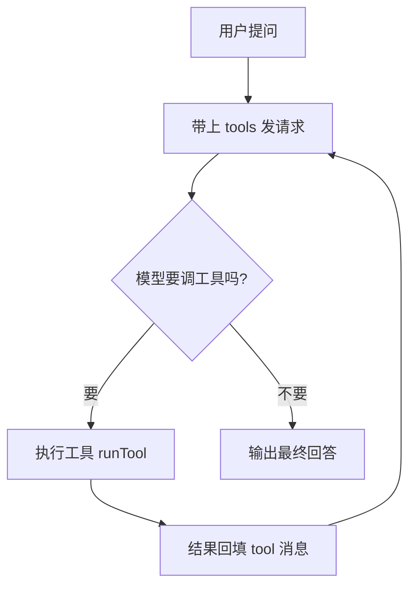

# Agent 开发 · 第 1 篇：Node 版 Agent 最小示例

> **定位**：NestJS 35 天完结后的第一个「Agent 应用开发」落地。技术路线定调：**主链路留在 Node/TS，不转 Python**。
> **配套项目**：`agent-lab/`（工作区根目录），四步从「会调 LLM」到「能接 MCP 工具」。
> **阅读方式**：概念优先，不背 API。能回答问题才算学会。

---

## 一、为什么是 Node 不是 Python

做 Agent 应用，**语言熟练度 > 生态流行度**。Python 是 Agent 生态的事实标准，但对一个 10 年 Node 老手，「用熟的那把锤子」收益远高于重爬一门语言。

| 维度 | Node 主链路（选它） | Python（不选它） |
| --- | --- | --- |
| 熟练度 | 10 年积累，直接上手 | 「会用但没系统学过」，重爬学习曲线 |
| 技术栈 | 与 `agent-hub`（NestJS）无缝衔接 | 两套栈并行，认知负担翻倍 |
| 生态缺口 | LangChain.js / OpenAI Node SDK / Vercel AI SDK 都是一等公民 | 生态最全，但用不上那 20% 前沿 |
| 定位 | 主战场 | 旁路：读懂/跑通别人的开源实现 |

> **Python 的准确定位**：只在你「读论文实现 / 跑现成脚本 / 某个模型只有 Python 版」时以脚本级出现，写完暴露成 HTTP/MCP 接口桥回 Node。这个程度「会用」就够。

---

## 二、Agent 到底是什么

一句话：**Agent = 模型 + 工具 + 循环**。

```
Agent
├── 模型  理解意图、决定下一步（LLM 只"想"，不"做"）
├── 工具  真正干活：查库 / 调 API / 算数（代码写的函数）
└── 循环  调工具 → 拿结果 → 再思考 → 直到能回答
```

- 普通 LLM 调用：你问 → 它答（一问一答，只有"想"）
- Agent：你问 → 它判断「我需要用某个工具」→ 调工具 → 拿结果 → 再组织答案（"想"+"做"+"循环"）

---

## 三、四步递进总览

| 步骤 | 命令 | 讲什么 | 验收 |
| --- | --- | --- | --- |
| 01 | `npm run 01` | 流式 LLM 调用 | 终端看到模型逐字输出 |
| 02 | `npm run 02` | Function Call：`tools` 参数 + `tool_calls` 回填循环 | 模型能查天气 / 算数 |
| 03 | `npm run 03` | RAG：切分 → embedding → 检索 → 带上下文回答 | 模型读你的私域文档回答 |
| 04 | `npm run 04` | MCP 客户端接 stdio 服务端 | 模型通过 MCP 协议调外部工具 |

---

## 四、核心原理：Function Call 循环（Agent 的灵魂）



关键在三点：

1. **`tools` 参数**：告诉模型「你能调哪些工具、每个工具的参数长啥样」。模型靠 `description` + `parameters`（JSON Schema）来"看懂"工具。
2. **`tool_calls` 响应**：模型不直接回答，而是返回「我要调 `get_weather`，参数 `{city:"深圳"}`」。注意：模型只**决定**调什么、传什么参，**不真正执行**。
3. **回填 `tool` 消息**：你的代码执行工具、拿到结果，把结果作为 `role:"tool"` 的消息塞回上下文，再发一轮请求，直到模型不再要工具、给出最终回答。

> **一句话记住**：模型是「大脑」，工具是「手脚」，循环是「大脑指挥手脚、手脚反馈结果」的反复过程。

---

## 五、代码对照（agent-lab/src/02-function-call.ts）

```ts
// 1. 声明工具（模型能看懂的"能力说明书"）
const tools = [{
  type: 'function',
  function: {
    name: 'get_weather',
    description: '查询指定城市的实时天气',
    parameters: { type: 'object', properties: { city: { type: 'string' } }, required: ['city'] },
  },
}];

// 2. Agent 循环：每轮都带 tools 发请求
for (let round = 1; round <= 5; round++) {
  const res = await client.chat.completions.create({ model, messages, tools, tool_choice: 'auto' });
  const msg = res.choices[0].message;

  // 3. 没要工具 → 模型已经能回答，结束
  if (!msg.tool_calls?.length) return msg.content;

  // 4. 要工具 → 执行并回填
  messages.push(msg);                       // 先把 assistant 消息（含 tool_calls）存进上下文
  for (const tc of msg.tool_calls) {
    const result = await runTool(tc.function.name, JSON.parse(tc.function.arguments));
    messages.push({ role: 'tool', tool_call_id: tc.id, content: result }); // 回填结果
  }
}
```

---

## 六、RAG 一句话（03）

模型不知道你的私域数据 → 把资料切成块转成向量（embedding）→ 问题也转向量 → 找最相近的几块 → 拼进 prompt 让模型「带着资料」回答。**本质是"喂上下文"，不是"教模型记东西"。**

> **真实工程坑**：Chat Completions 各家基本都兼容 OpenAI 协议，但 **embedding 接口并不统一**——OpenAI 用 `{input}` → `{data[].embedding}`，MiniMax 用 `{texts, type:'db'|'query'}` → `{vectors}`。所以 `agent-lab` 在 `lib/llm.ts` 的 `embed()` 里做了适配，把厂商差异收在一处。

## 七、MCP 一句话（04）

MCP 是「工具调用的标准协议」——你的 Agent 不用为每个外部服务写专属胶水代码，只要 MCP 客户端按协议连上去，就能 `listTools` 拿到工具、`callTool` 调用。**Function Call 是"模型怎么想"，MCP 是"工具从哪来"。**

---

## 八、运行

```bash
cd agent-lab
NODE_OPTIONS= npm install        # WorkBuddy 沙箱里带 NODE_OPTIONS= 清 shim
cp .env.example .env              # 填 OPENAI_API_KEY（或改 BASE_URL 指向兼容端点）
npm run 02 "深圳今天天气怎么样？"   # 其它步骤同理
```

---

## 九、自检清单

- [ ] Agent 和普通 LLM 调用的区别是什么？
- [ ] `tools` 参数是给谁看的？模型靠什么"看懂"工具？
- [ ] `tool_calls` 返回后，模型自己会执行工具吗？谁执行？
- [ ] 工具结果怎么回到模型？`role:"tool"` 消息的作用？
- [ ] RAG 解决的到底是什么问题？
- [ ] Function Call 和 MCP 分别解决 Agent 的哪个环节？

---

**下一篇预告**：把 agent-lab 的 Agent 循环接进 `agent-hub`（NestJS），让后端真正拥有「模型 + 工具 + 流式输出」的完整闭环。
