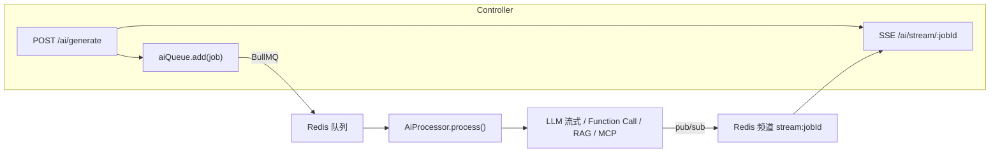

# Agent 开发 · 第 2 篇：Agent 循环接进 NestJS（agent-hub）

> **定位**：把第 1 篇 `agent-lab` 里的「流式 LLM + Function Call + RAG + MCP」四要素，落进真实后端 `agent-hub`（NestJS），让后端拥有「模型 + 工具 + 流式输出」的完整闭环。
> **配套项目**：`agent-hub/`（工作区根目录）。本篇全部改动均已跑通 E2E（12/12）并对接真实 MiniMax 验证。
> **阅读方式**：先看架构全景，再逐要素看「怎么接」，最后背四个坑。

---

## 一、为什么要把 Agent 接进 NestJS

`agent-lab` 是「脚本级」验证——一个 `main()` 跑到底就结束。真实产品里，Agent 能力要被 HTTP 接口调用、要能并发、要能流式推给前端。这些是 NestJS 的强项：

| 需求 | agent-lab（脚本） | agent-hub（NestJS） |
| --- | --- | --- |
| 被 HTTP 调用 | 每次手动 `npm run` | `POST /ai/generate`、`POST /ai/rag` 接口 |
| 流式输出给前端 | 只能 `console.log` | SSE（`@Sse`）逐字推送 |
| 长任务不阻塞 | 卡在 `main()` 里 | BullMQ 队列 + Worker 异步消费 |
| 多用户并发 | 无 | 每个任务独立 job，Redis pub/sub 分发 |
| 无 API Key 时的降级 | 直接报错 | mock 降级，保证接口可用、E2E 可跑 |

---

## 二、架构全景：一次请求的完整链路



关键设计：**Controller 只负责「接单」和「读流」，Processor 只负责「干活」和「写流」**，两者通过 Redis 队列（投递任务）和 Redis pub/sub（回传流）解耦。

- `AiService`：给 Controller 用的门面，`generate()` 入队、`subscribe()` 订阅流、`rag()` 入队 RAG 任务。
- `AiProcessor`（`@nestjs/bullmq` 的 `WorkerHost`）：真正调模型、执行工具、发流的地方。
- **没有 API Key 时**：Processor 走 `mockRun()`，吐模拟的分块和工具事件，保证 E2E 和本地演示都能跑。

---

## 三、要素一：流式 LLM（stream:true）

第 1 篇讲了「流式」就是模型逐字吐 token。在 NestJS 里，流不是一次性返回，而是「每拿到一块就 `publish` 一次」，前端 SSE 逐块收到。

```ts
// ai.processor.ts 里核心骨架
const stream = await this.client.chat.completions.create({
  model, messages, stream: true, // 关键开关
});
for await (const chunk of stream) {
  const delta = chunk.choices[0]?.delta?.content;
  if (delta) this.publish(job, { type: 'chunk', content: delta });
}
this.publish(job, { type: 'done' });
```

```ts
// publish() = 发一条 SSE 事件到 Redis 频道
private async publish(job: Job<GenerateJobData>, event: StreamEvent) {
  await this.redis.publish(`stream:${job.id}`, JSON.stringify(event));
}
```

> **记住**：流式 = `stream:true` + `for await` 逐块读 + 每块 `publish` 一次。`done` 事件标志结束，前端据此关闭连接。

---

## 四、要素二：Function Call 循环（接进 Processor）

脚本里的 `for` 循环，在 Processor 里变成「多轮 LLM 调用」。与 agent-lab 唯一的区别：**工具集合可以混搭**——本地工具（`tools.ts`）+ MCP 工具（运行时动态拿到）。

```ts
// ai.processor.ts · process() 里的 Function Call 循环
const allTools = [...tools, ...this.mcp.getTools()]; // 本地 + MCP
const messages: OpenAI.Chat.ChatCompletionMessageParam[] = [
  { role: 'system', content: SYSTEM_PROMPT },
  { role: 'user', content: prompt },
];

for (let round = 0; round < MAX_ROUNDS; round++) {
  const res = await this.client.chat.completions.create({
    model, messages, tools: allTools, tool_choice: 'auto',
  });
  const msg = res.choices[0].message;

  if (!msg.tool_calls?.length) {           // 模型能直接答了
    this.publish(job, { type: 'chunk', content: msg.content ?? '' });
    break;
  }

  messages.push(msg);                       // 先存 assistant（含 tool_calls）
  for (const tc of msg.tool_calls) {
    if (tc.type !== 'function') continue;   // 只看 function 类型（见坑④）
    this.publish(job, { type: 'tool_call', name: tc.function.name, args: JSON.parse(tc.function.arguments) });
    const result = await this.runToolOrMcp(tc.function.name, JSON.parse(tc.function.arguments));
    messages.push({ role: 'tool', tool_call_id: tc.id, content: result });
  }
}
this.publish(job, { type: 'done' });
```

```ts
// runToolOrMcp：本地工具优先，否则交给 MCP
private async runToolOrMcp(name: string, args: Record<string, unknown>) {
  if (LOCAL_TOOL_NAMES.has(name)) return runTool(name, args);
  return await this.mcp.callTool(name, args) ?? `未知工具：${name}`;
}
```

---

## 五、要素三：RAG（retrieve → 拼上下文 → 流式回答）

RAG 任务走独立的 `ragRun()`，流程分三步：

```ts
// ai.processor.ts · ragRun()
private async ragRun(job: Job<GenerateJobData>) {
  const question = job.data.prompt;
  // 1. 检索：问题转向量 → 找最相近的 2 块文档
  const hits = await retrieve(question, 2);
  this.publish(job, { type: 'tool_call', name: 'retrieve', args: { question, hits } });

  // 2. 把命中的文档拼成 system 上下文
  const context = hits.map((h) => h.text).join('\n\n');
  const messages = [
    { role: 'system', content: `根据以下资料回答问题：\n${context}` },
    { role: 'user', content: question },
  ];

  // 3. 带上下文流式回答
  const stream = await this.client.chat.completions.create({ model, messages, stream: true });
  for await (const chunk of stream) { /* publish chunk */ }
  this.publish(job, { type: 'done' });
}
```

`retrieve()` 的实现（`rag.ts`）：4 篇内置文档 → 各自 embedding → 问题也 embedding → 余弦相似度排序 → 取 topK。

---

## 六、要素四：MCP（ESM 服务端 + 动态 import 客户端）

MCP 在 NestJS 里最大的坑是**模块规范**：`@modelcontextprotocol/sdk` 是 **ESM-only**（`package.json` 里 `type: module`），而 `agent-hub` 是 CommonJS（`module: commonjs`）。直接 `import` 会被 tsc 编译成 `require`，运行时报 `ERR_REQUIRE_ESM`。

解法分两步：

**① 服务端单独写一个 `.mjs` 文件**（`src/mcp/demo-server.mjs`），不被 tsc 编译，天然是 ESM：

```js
// demo-server.mjs
import { McpServer } from '@modelcontextprotocol/sdk/server/mcp.js';
import { StdioServerTransport } from '@modelcontextprotocol/sdk/server/stdio.js';

const server = new McpServer({ name: 'demo', version: '1.0.0' });
server.tool('add', '两数相加', { a: { type: 'number' }, b: { type: 'number' } }, async ({ a, b }) => ({
  content: [{ type: 'text', text: String(a + b) }],
}));
server.tool('echo', '回显文本', { text: { type: 'string' } }, async ({ text }) => ({
  content: [{ type: 'text', text }],
}));
await server.connect(new StdioServerTransport());
```

**② 客户端用动态 `await import()`**，并把模块名放进变量（避免 tsc 把静态 import 转成 `require`）：

```ts
// mcp.service.ts
async onModuleInit() {
  const { Client } = await import('@modelcontextprotocol/sdk/client/index.js'); // 变量名，避开 tsc
  const { StdioClientTransport } = await import('@modelcontextprotocol/sdk/client/stdio.js');

  const transport = new StdioClientTransport({
    command: process.execPath,                    // 用 node 跑 .mjs
    args: [path.join(process.cwd(), 'src/mcp/demo-server.mjs')],
  });
  this.client = new Client({ name: 'agent-hub', version: '1.0.0' });
  await this.client.connect(transport);

  const { tools } = await this.client.listTools();
  this.tools = tools.map((t) => ({                    // 映射成 OpenAI 工具格式
    type: 'function' as const,
    function: { name: t.name, description: t.description ?? '', parameters: t.inputSchema },
  }));
}

getTools() { return this.tools; }
async callTool(name: string, args: Record<string, unknown>) {
  const r = await this.client.callTool({ name, arguments: args });
  return (r.content as any).map((c: any) => c.text).join('\n');
}
```

> **一句话记住**：MCP = 「模型怎么想（Function Call）」之外的「工具从哪来」。接进 NestJS 的关键是绕开 ESM/CJS 冲突——`.mjs` 服务端 + 动态 `import()` 客户端。

---

## 七、四个真实工程坑（都踩过）

| 坑 | 现象 | 根因 | 解法 |
| --- | --- | --- | --- |
| ① embedding 非标准 | RAG 报 `401 Incorrect API key ...platform.openai.com` | `rag.ts` 把 `process.env.OPENAI_BASE_URL` 读成了模块级常量，在 `.env` 加载**之前**求值，落回 OpenAI 端点 | BASE/是否 MiniMax/模型名都**移到函数内部**读；agent-lab 用 `import 'dotenv/config'` 所以模块级没问题，NestJS 走 ConfigModule 晚加载 |
| ② env 时序 | 同上 | NestJS ConfigModule 在模块 import **之后**才加载 `.env` | 凡依赖 env 的值，一律在函数内读取，别写模块级 `const` |
| ③ ESM/CJS | `ERR_REQUIRE_ESM` | `@modelcontextprotocol/sdk` 是 ESM-only，CommonJS `require` 它报错 | `.mjs` 服务端 + 动态 `await import()` 客户端 |
| ④ SDK 联合类型 | `TS2339 Property 'function' does not exist` | OpenAI SDK v7 的 `tool_calls` / `ChatCompletionTool` 是联合类型（function + custom），直接 `.function` 不收敛 | 先 `if (tc.type !== 'function') continue;` 再访问 `tc.function`；`tools` 数组同样 `.filter(t => t.type === 'function')` |

> **坑①④ 是最有普适性的两条**：① 提醒你「环境变量读太早」是 NestJS 常见病；④ 提醒你「SDK 类型没窄化」是现代 TS 联合类型的常见病。

---

## 八、运行与验证

```bash
cd agent-hub
NODE_OPTIONS= npm install                          # 沙箱里清 shim
docker compose up -d db redis                      # 起 Postgres + Redis
cp .env.example .env                               # 填 OPENAI_API_KEY / OPENAI_BASE_URL / OPENAI_MODEL
NODE_OPTIONS= npm run start:dev                    # 起后端
```

验证四要素（SSE 逐个确认）：

```bash
# 流式：curl --noproxy '*' -N http://localhost:3000/ai/stream/<jobId>
# Function Call：问「北京天气怎么样」→ 收到 tool_call(get_weather) 事件
# RAG：POST /ai/rag → 收到 retrieve 事件 + 带资料的回答
# MCP：问「帮我算 3+4」→ 模型经 MCP 调 add 工具
NODE_OPTIONS= npm run test:e2e                     # 12/12 全绿（mock 路径，不依赖真实 Key）
```

---

## 九、自检清单

- [ ] Controller / Processor / Redis 三者怎么分工？任务和流分别靠什么解耦？
- [ ] 流式输出里 `stream:true`、`for await`、`publish`、`done` 各是什么作用？
- [ ] Function Call 循环里，`allTools` 由哪两部分组成？为什么？
- [ ] RAG 的三步（检索 → 拼上下文 → 回答）分别在哪？
- [ ] 为什么 MCP 服务端要写 `.mjs`？客户端为什么用动态 `import()`？
- [ ] 四个坑里，哪两个最有普适性？各自一句话讲清根因和解法。

---

**下一篇预告**：把 `xiaohongshu-mcp` 这类「真实业务 MCP」替换掉 demo 服务端，让 agent-hub 的 Agent 真正连上小红书内容电商工具链。
