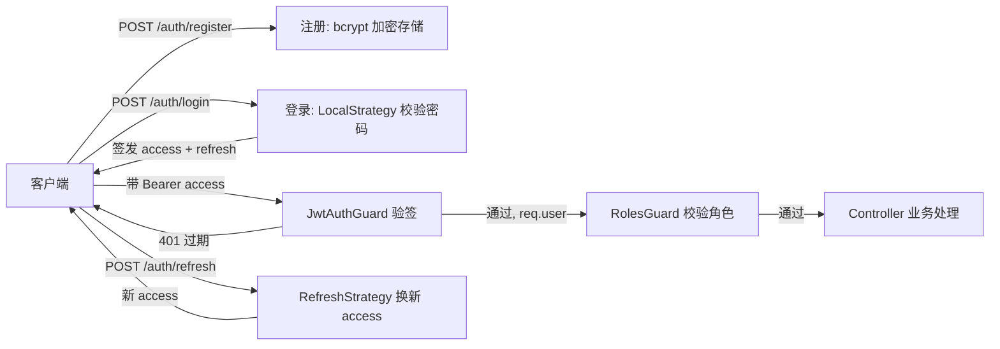

# 📙 Day 21：认证实战整合

> 前置回顾：Day 18~20 分别搞懂了 JWT 原理、Passport 策略、RBAC 授权。本篇收官阶段五——把**注册 / 登录 / 刷新 / 受保护接口**完整串起来，并补上密码安全（bcrypt）。这是阶段五的交付能力：**一个完整、安全的认证体系**。

---

## 21.1 完整项目结构

```
src/
├── auth/
│   ├── auth.module.ts
│   ├── auth.service.ts
│   ├── auth.controller.ts
│   ├── local.strategy.ts
│   ├── jwt.strategy.ts
│   ├── refresh.strategy.ts
│   ├── local-auth.guard.ts
│   ├── jwt-auth.guard.ts
│   ├── refresh-auth.guard.ts
│   ├── decorators/
│   │   ├── roles.decorator.ts
│   │   ├── public.decorator.ts
│   │   └── current-user.decorator.ts
│   └── dto/
│       ├── login.dto.ts
│       └── register.dto.ts
├── users/
│   ├── users.module.ts
│   ├── users.service.ts
│   └── users.controller.ts
├── common/
│   └── guards/roles.guard.ts
└── prisma/
    └── prisma.service.ts
```

---

## 21.2 密码安全：bcrypt

**明文存密码 = 灾难**。数据库泄露时，攻击者直接拿到所有密码。正确做法是**哈希 + 加盐**。

```ts
// 注册时：加密存储
const hash = await bcrypt.hash(password, 10);   // 10 是 salt 轮数

// 登录时：比对
const isValid = await bcrypt.compare(password, hash);
```

| 库 | 特点 |
| ---- | ---- |
| `bcrypt` | 经典，自动加盐，`hash`/`compare` |
| `argon2` | 更现代，内存硬抗 GPU 破解 |

> 关键认知：**哈希是单向的**，存的是 `hash` 不是密码。登录时不是"解密"比对，而是"把输入的密码再哈希一次，看结果是否一致"。`rounds=10` 是性能与安全的平衡点。

---

## 21.3 注册流程

```ts
// users.service.ts
async register(dto: RegisterDto) {
  const exists = await this.prisma.user.findUnique({
    where: { email: dto.email },
  });
  if (exists) throw new ConflictException('邮箱已注册');

  const hashed = await bcrypt.hash(dto.password, 10);
  const user = await this.prisma.user.create({
    data: { email: dto.email, password: hashed, role: Role.User },
  });
  const { password, ...result } = user;   // 返回前剥离密码
  return result;
}
```

```ts
// auth.controller.ts
@Public()
@Post('register')
async register(@Body() dto: RegisterDto) {
  return this.usersService.register(dto);
}
```

> `@Public()` 放行注册接口（无需 token），配合 DTO 校验（串 Day 7/11）保证输入合法。

---

## 21.4 登录流程（签发双 token）

```ts
// auth.service.ts
async login(user: any) {
  const payload = { sub: user.id, role: user.role };
  return {
    accessToken: this.jwtService.sign(payload, { expiresIn: '15m' }),
    refreshToken: this.jwtService.sign(
      { sub: user.id },
      { secret: process.env.JWT_REFRESH_SECRET, expiresIn: '7d' },
    ),
  };
}
```

```ts
// auth.controller.ts
@Public()
@UseGuards(LocalAuthGuard)   // 走 LocalStrategy 校验密码
@Post('login')
@HttpCode(200)
async login(@Request() req) {
  return this.authService.login(req.user);
}
```

> 注意：**Access 和 Refresh 建议用不同密钥**（`JWT_SECRET` vs `JWT_REFRESH_SECRET`），降低 Refresh 密钥泄露时的连带风险。

---

## 21.5 刷新 token 流程

```ts
// refresh.strategy.ts
@Injectable()
export class RefreshStrategy extends PassportStrategy(Strategy, 'jwt-refresh') {
  constructor() {
    super({
      jwtFromRequest: ExtractJwt.fromAuthHeaderAsBearerToken(),
      secretOrKey: process.env.JWT_REFRESH_SECRET,
      passReqToCallback: true,
    });
  }

  async validate(req: any, payload: any) {
    const refreshToken = req.get('Authorization').replace('Bearer ', '');
    return { userId: payload.sub, refreshToken };
  }
}
```

```ts
// refresh-auth.guard.ts
@Injectable()
export class RefreshAuthGuard extends AuthGuard('jwt-refresh') {}

// auth.controller.ts
@Public()
@UseGuards(RefreshAuthGuard)
@Post('refresh')
async refresh(@Request() req) {
  return this.authService.refresh(req.user);
}
```

```ts
// auth.service.ts
async refresh(user: any) {
  const payload = { sub: user.userId, role: user.role };
  return {
    accessToken: this.jwtService.sign(payload, { expiresIn: '15m' }),
  };
}
```

> 策略通过第二个参数命名 `'jwt-refresh'`，与 `AuthGuard('jwt-refresh')` 绑定，实现"同一个 Passport，多套 JWT 策略"。

---

## 21.6 受保护接口（完整 RBAC）

```ts
// users.controller.ts
@Controller('users')
export class UsersController {
  constructor(private usersService: UsersService) {}

  @Get('profile')
  getProfile(@CurrentUser() user: any) {
    return this.usersService.findOne(user.userId);
  }

  @Roles(Role.Admin)
  @Delete(':id')
  remove(@Param('id', ParseIntPipe) id: number) {
    return this.usersService.remove(id);
  }
}
```

### @CurrentUser 装饰器（优雅取当前用户）

```ts
// current-user.decorator.ts
export const CurrentUser = createParamDecorator(
  (data: unknown, ctx: ExecutionContext) => {
    const request = ctx.switchToHttp().getRequest();
    return request.user;   // JwtStrategy.validate 的返回值
  },
);
```

> 比 `@Request() req` 然后 `req.user` 更简洁、类型更清晰。

---

## 21.7 全局守卫装配（先认证后授权）

```ts
// app.module.ts
@Module({
  imports: [AuthModule, UsersModule],
  providers: [
    { provide: APP_GUARD, useClass: JwtAuthGuard },   // ① 全局认证
    { provide: APP_GUARD, useClass: RolesGuard },      // ② 全局授权
  ],
})
export class AppModule {}
```

---

## 21.8 完整链路串联图



> 核心流转：**注册存哈希 → 登录发 token → 请求验签 → 角色鉴权 → 过期刷新**。

---

## 21.9 阶段五完成总结

| Day | 主题 | 核心产出 |
| --- | ---- | ---- |
| Day 18 | JWT 认证原理 | 认证vs授权、无状态、三段式、签名、双 token、安全边界 |
| Day 19 | Passport 策略 | Strategy 抽象、Local/Jwt 策略、AuthGuard 绑定、AuthModule |
| Day 20 | RBAC 权限 | Role vs Permission、@Roles + RolesGuard、@Public、全局守卫 |
| Day 21 | 认证实战整合 | 注册/登录/刷新全流程、bcrypt、@CurrentUser、完整串联 |

**一句话串联**：**JWT 确认"你是谁"（Day 18）→ Passport 优雅落地认证（Day 19）→ RBAC 控制"你能干什么"（Day 20）→ 全部串成完整认证体系（Day 21）**。

**下一阶段**：工程化 / Testing / Docker（4 天）——把代码变成可测试、可部署的工程。

---

## 21.10 自检清单

- [ ] 为什么密码要 bcrypt 加密？`compare` 是解密还是重新哈希？
- [ ] Access 和 Refresh Token 为什么用不同密钥？
- [ ] `@Public()` 的作用？配合全局 JwtAuthGuard 怎么用？
- [ ] `@CurrentUser` 装饰器原理？
- [ ] `PassportStrategy(Strategy, 'jwt-refresh')` 第二个参数的作用？
- [ ] 全局守卫装配的先后顺序？为什么？
- [ ] 能否完整画出发送登录请求到获取 profile 的链路？

---

## 🔗 上下篇

← [Day 20：RBAC 权限控制](/day20-rbac) ｜ → [Day 22：工程化与配置管理](/day22-config-logging)
