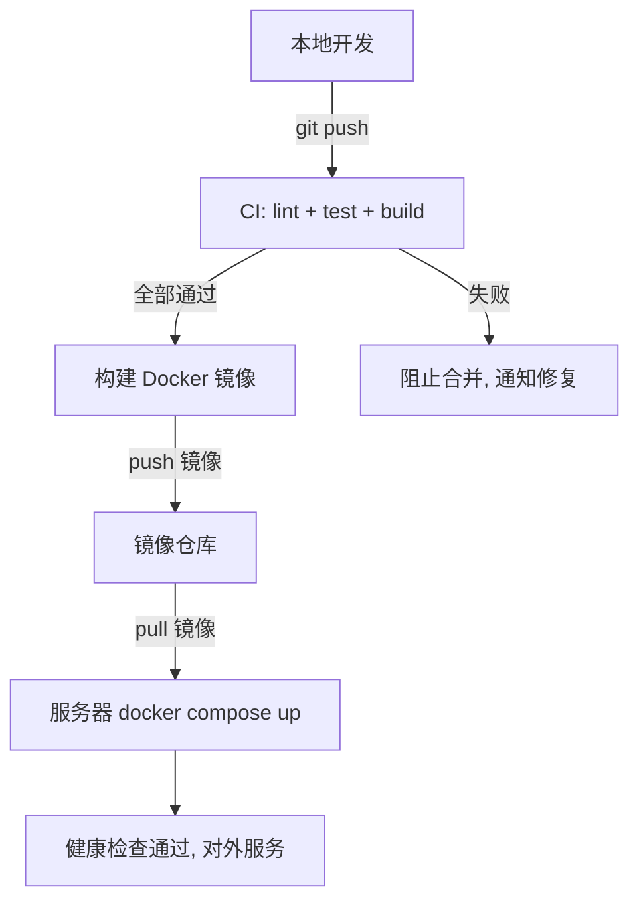

# 📙 Day 25：工程化实战整合

> 前置回顾：Day 22~24 分别搞定配置、日志、测试、Docker。本篇收官阶段六——把**配置 → 日志 → 测试 → 容器化 → 部署**串成完整工程化闭环，并引入 CI/CD 概念。

---

## 25.1 完整工程化项目结构

```
my-nest-app/
├── src/                       # 源码（Day 22 结构）
├── test/                      # E2E 测试
│   └── app.e2e-spec.ts
├── prisma/
│   ├── schema.prisma
│   └── migrations/
├── .env                       # 本地环境变量（不提交）
├── .env.example               # 环境变量模板（提交）
├── .gitignore
├── .dockerignore
├── Dockerfile                 # 多阶段构建
├── docker-compose.yml         # 编排 app + db
├── .github/workflows/ci.yml   # CI 流水线
├── package.json
└── jest.config.js
```

---

## 25.2 工程化四件套串联

```
配置（Day 22）  →  日志（Day 22）  →  测试（Day 23）  →  容器化（Day 24）
     ↓                    ↓                  ↓                  ↓
 ConfigModule         pino+traceId      unit+e2e           Dockerfile
  + Joi 校验           结构化日志        覆盖率门槛          + compose
```

**它们如何配合**：

- **配置**：`ConfigModule` + Joi 校验，确保启动时配置完整合法
- **日志**：pino 结构化日志 + traceId，出问题可追踪
- **测试**：单元测试保逻辑、E2E 保流程，覆盖率门槛兜底
- **容器化**：Dockerfile 固化环境、compose 编排服务

> 一句话：**配置保证"跑对"，日志保证"能查"，测试保证"没坏"，Docker 保证"到处能跑"**。

---

## 25.3 CI/CD 概念（GitHub Actions）

### CI（持续集成）

代码 push 后自动：装依赖 → 跑测试 → 构建，保证"合进去的代码是好的"。

```yaml
# .github/workflows/ci.yml
name: CI

on:
  push:
    branches: [main]
  pull_request:
    branches: [main]

jobs:
  test:
    runs-on: ubuntu-latest
    steps:
      - uses: actions/checkout@v4

      - uses: actions/setup-node@v4
        with:
          node-version: 20
          cache: 'npm'

      - run: npm ci
      - run: npm run lint          # 代码规范检查
      - run: npm test -- --coverage  # 跑测试 + 覆盖率
      - run: npm run build         # 构建验证
```

### CD（持续部署）

CI 通过后自动部署到服务器/云平台。

```yaml
# 简化的部署步骤（概念示意）
deploy:
  runs-on: ubuntu-latest
  needs: test                       # 依赖 test 通过
  steps:
    - uses: actions/checkout@v4
    - run: docker build -t my-app .
    - run: docker push myregistry/my-app:latest   # 推镜像
    # SSH 到服务器 pull + restart
```

> 概念记忆：**CI = 合并前的自动体检；CD = 体检通过后的自动上线**。

---

## 25.4 从开发到部署的完整流程



---

## 25.5 阶段六完成总结

| Day | 主题 | 核心产出 |
| --- | ---- | ---- |
| Day 22 | 工程化与配置管理 | ConfigModule、Joi 校验、环境隔离、pino 日志、traceId、项目结构 |
| Day 23 | 测试 | 测试金字塔、TestingModule、单元测试、E2E、覆盖率 |
| Day 24 | Docker 容器化 | 多阶段构建、.dockerignore、compose 编排、健康检查 |
| Day 25 | 工程化实战整合 | 四件套串联、CI/CD、完整部署流程 |

**一句话串联**：**配置跑对（Day 22）→ 测试保没坏（Day 23）→ Docker 到处跑（Day 24）→ CI/CD 自动上线（Day 25）**。

**下一阶段**：Redis / BullMQ / SSE / WebSocket（4 天）——异步、缓存、实时通信，向 Agent 应用的"实时性"迈进。

---

## 25.6 自检清单

- [ ] 工程化四件套分别解决什么问题？如何配合？
- [ ] CI 和 CD 分别是什么？各包含哪些步骤？
- [ ] 一条完整的"本地开发 → 上线"流程是什么？
- [ ] 为什么要加 `.env.example` 而 `.env` 不提交？
- [ ] 覆盖率门槛应该设多少？它是目标吗？
- [ ] Docker 多阶段构建的产物怎么传给运行阶段？

---

## 🔗 上下篇

← [Day 24：Docker 容器化](/day24-docker) ｜ → [Day 26：Redis 缓存](/day26-redis)
