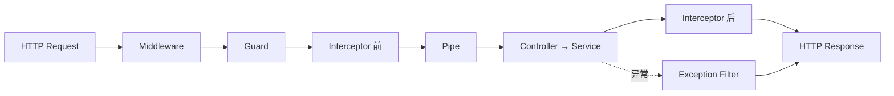

# 📙 Day 3：请求生命周期（Request Lifecycle）

## 3.1 两套"生命周期"（同名不同义）

| 类型         | 关注            | 关键钩子                                                                                                          |
| ---------- | ------------- | ------------------------------------------------------------------------------------------------------------- |
| **应用生命周期** | 启动/初始化/销毁     | `onModuleInit → onApplicationBootstrap → onModuleDestroy → beforeApplicationShutdown → onApplicationShutdown` |
| **请求生命周期** | 一次 HTTP 请求的流转 | `Middleware → Guard → Interceptor → Pipe → Controller → Filter`                                               |

> 应用生命周期适合管理 Database/Redis/MQ/Worker 等资源（如 `RedisService` 的连接与关闭）。本篇重点在请求链路。

## 3.2 请求链路顺序（面试必背）

一句话：**Middleware 预处理，Guard 决定能不能进，Pipe 处理输入，Interceptor 包裹执行，Controller 负责 HTTP 层，Filter 处理异常。**

## 3.3 各组件职责

| 组件                   | 一句话                                  | 典型场景                                         |
| -------------------- | ------------------------------------ | -------------------------------------------- |
| **Middleware**       | 最靠前，通用预处理；**不关心**最终进哪个 Handler       | 请求日志 / traceId / Header / Cookie             |
| **Guard**            | "门卫"：你是谁？有没有权限？能拿 `ExecutionContext` | JWT / RBAC / API Key                         |
| **Interceptor**      | 用 `next.handle()` **包裹** Handler 前后  | 统一 Response / 耗时 / 缓存                        |
| **Pipe**             | 数据"对不对"：校验 + 转换                      | `ParseIntPipe`(`"100"`→`100`)、ValidationPipe |
| **Controller**       | 进 HTTP Handler，只做收参→调 Service→返回     | —                                            |
| **Exception Filter** | 统一异常格式                               | `404 → {code,message,timestamp}`             |

## 3.4 关键澄清

- **JWT 不写 Middleware 的原因**：Middleware 不知 Handler 有无 `@Roles()`；Guard 通过 `ExecutionContext` 拿 Handler Metadata，职责更清晰。
- **Guard × Metadata 闭环**（串 Day 2）：`@Roles('admin')` → `SetMetadata('roles')` → `RolesGuard` + `Reflector` 读取判断。
- **ExecutionContext** = 当前执行上下文，可取 `Request / Handler / Controller`，支持 HTTP/WebSocket/RPC。
- **Interceptor 用 RxJS**：`next.handle()` 返回 `Observable`，可用 `tap`(日志/耗时)、`map`(统一响应)、`catchError`、`timeout`。
- **Service 不是生命周期阶段**：`Controller → Service → Repository → Database` 是**业务调用链**，框架链路里没有"Service 阶段"，两套概念别混。

**Day 3 自检**：Middleware 和 Guard 区别？Guard 为什么适合权限？Pipe 为什么负责校验？Interceptor 为什么能处理 Response？Exception Filter 何时执行？ExecutionContext 是什么？
